# docstring2md:
[]()


Generating documentation from code can be a tedious and time-consuming
task.
By offering a simple and easy-to-use tool, this package aims to make the
process of creating documentation more efficient. It allows users to
extract useful information, such as function descriptions and input/output
specifications, directly from the source code (DocStrings). This can
save a  lot of time  and effort that would otherwise be spent manually
writing documentation. In addition, having documentation automatically
generated from code ensures that it stays up-to-date as the codebase
changes. Overall, this package provides a convenient solution for
generating high-quality documentation for Python projects.
All the installation process has been rebuilt with Makefile and
pyproject.toml.

# Why ?:
We can find a lot of tools to generate docs from code, but we want
something quick and easy to set up.
This tool can be used on python file or python package.

Semantic analysis and tree traversal are not really my passions ^^,
but these types of tools are still very interesting. Some time has passed
since the first version. I admit that Python had started to introduce
typing, but it was, not yet widespread. There have also been significant
changes in the deployment of packages, and since the script setup.py has
no reason to exist. I have therefore migrated to the TOML file and
adapted the META import libraries.
It's true that I might have done this sooner, but I ran out of time and was
always using somewhat outdated versions of Python. Changes in the language
are constant. This new version is therefore a complete refresh, allowing
me to be more in line with what is currently being done in the Python
ecosystem.

# Use:
Use the script:
```
Usage: export_docstring2md [-h] [--version] [--debug | --quiet]
                           [--logfile LOGFILE] [--toc] [--private-def]
                           -p PACKAGE [-o OUTPUT_FILE] [-tml TOML_FILE]
                           [-td TODO_FILE] [-mmd MERMAID_FILE]

This script is provided by docstring2md package.
It exports google docstrings from python module to a Markdown file in order
to generate README.

Options:
  -h, --help            show this help message and exit
  --version             show version and exit
  --debug               print debug messages to stderr
  --quiet               print error messages to stderr
  --logfile LOGFILE     /path/to/file.log
  --toc                 Enable the table of contents
  --private-def         Enable the table of contents

Required Arguments:
  -p, --package PACKAGE
                        define the /path/to/the/package or
                        <package_name>

Optional Arguments:
  -o, --output-file OUTPUT_FILE
                        /path/to/output/file (README.md)
  -tml, --toml-file TOML_FILE
                        /path/to/toml/file.toml
  -td, --todo-file TODO_FILE
                        /path/to/todo/file.md
  -mmd, --mermaid-file MERMAID_FILE
                        /path/to/mermaid/file.mmd

COMPATIBILITY:
    Python 3.7+ - https://www.python.org/
EXIT STATUS:
    This script exits 0 on success, and >0 if an error occurs:
    - EX_OK: 0 -> success
    - EX_CONFIG: 78 -> config error
    - EX_OSFILE: 72 -> module not found
    - EX_CANTCREAT: 73 -> can not create the file
    - EX_IOERR: 74 -> write error
```

# Setup:
- User:

Get the package:
```shell
git clone https://github.com/francois-le-ko4la/docstring-to-markdown.git
```
Enter in the directory:
```shell
cd docstring-to-markdown
```
Install with make on Linux/Unix/MacOS or use pip3 otherwise:
```shell
make install
```

- Dev environment:

Get the package:
```shell
git clone https://github.com/francois-le-ko4la/docstring-to-markdown.git
```
Enter in the directory:
```shell
cd docstring-to-markdown
```
Create your environment with all dev prerequisites and install the package:
```shell
make venv
source venv/bin/activate
make dev
```

# Test:
This module has been tested and validated on Ubuntu.
Test is available if you set up the package with dev environment.
```shell
make test
```

# License:
This package is distributed under the [GPLv3 license](./LICENSE)
# Todo:

- [X] Create the project
- [X] Write code and tests
- [X] Test installation and requirements (setup.py and/or Makefile)
- [X] Test code
- [X] Validate features
- [X] Add-on : decorator
- [X] Add-on : class properties
- [X] Add-on : runtime & requirements
- [X] Add-on : toc
- [X] Add-on : remove inspect library and use AST
- [X] Add-on : improve global performance (x3)
- [X] Write Doc/stringdoc
- [X] Run PEP8 validation
- [X] Clean & last check
- [X] Release 0.4.1
- [X] Rebuild the cli argument
- [X] Rebuild logging management and add more debug
- [X] Rebuild the package management through pyproject.toml
- [X] Rebuild the Makefile
- [X] Add-on : typing analysis
- [X] Create JSON module example
- [X] Finish the typing
- [X] AST optimisation
- [X] Improve CONST
- [X] improve doctest look & feel
- [X] homogeneous doc btw Class and Function
- [X] Include import in init file
- [X] Improve the docstring module (MD format is not standard ^^)
- [X] Move the todo from init to a dedicated file (new option)
- [ ] Test
- [ ] Release 0.5.0

# Dev notes
## TOML file:

```toml

# -*- coding: utf-8 -*-
[project]
name = "docstring2md"
version = "0.5.0"
authors = [
  {name = "ko4la" }
]
description = "Docstring extractor to generate readme."
license = {file = "LICENSE"}
readme = "README.md"
requires-python = ">=3.7"
classifiers = [
    "Development Status :: 5 - Stable",
    "Environment :: Console",
    "Intended Audience :: Developers",
    "Programming Language :: Python :: 3",
    "Programming Language :: Python :: 3.7",
    "Programming Language :: Python :: 3.8",
    "Programming Language :: Python :: 3.9",
    "Programming Language :: Python :: 3.10",
    "Programming Language :: Python :: 3.11",
    "Programming Language :: Python :: 3 :: Only",
    "OSI Approved :: GNU General Public License v3 (GPLv3)",
]
dependencies = [
    "PyYAML>=3.12",
    "rich>=12.6.0",
    "rich_argparse>=0.6.0",
    "importlib-metadata ~= 1.0 ; python_version < '3.8'"
    ]

[project.optional-dependencies]
dev = [
    "pycodestyle>=2.3.1",
    "pytest>=7.2.0",
    "pylint",
    "mypy",
    "pytest-pylint",
    "pytest-pycodestyle",
    "pytest-mypy",
    "types-setuptools",
    "types-PyYAML"]

[project.scripts]
export_docstring2md = "docstring2md.cli:run"

[build-system]
requires = ["setuptools"]
build-backend = "setuptools.build_meta"

[tool.pytest.ini_options]
minversion = "7.2"
addopts = [
    "-v",
    "--pycodestyle",
    "--doctest-modules",
    "--mypy",
    "--pylint",
    "--strict-markers"
]
xfail_strict = true
filterwarnings = [
    "ignore:.*U.*mode is deprecated:DeprecationWarning",
    "ignore::DeprecationWarning"]
[tool.mypy]
mypy_path = "stubs/"


```

## UML Diagram:

```mermaid

classDiagram
  class DocString2MDOptions {
    output
    private_def
    toc
    todo
    toml
    uml
  }
  class LoggingMSG {
    debug
    error
    info
    warning
  }
  class MyFile {
    exists
    path
    status
    absolute() str
    read() str
    resolve() str
    set_path(path: Union[str, None]) MyFile
    write(data: str) int
  }
  class NodeVisitor {
    generic_visit(node)
    visit(node)
    visit_Constant(node)
  }
  class PytMod {
    module
    node_lst
    pkg_main_docstring
    ismodule() bool
    read() None
  }
  class Const {
    coma : str
    decorator_tag : str
    dev_head : str
    dev_obj : str
    dev_toml : str
    dev_uml : str
    docstring_empty : str
    dot : str
    function_tag : str
    head_tag : str
    property_tag : str
  }
  class LoggingMSG {
    debug : str
    error : str
    info : str
    warning : str
  }
  class LoggingMSGCollection {
    args
    dump
    elapse_time
    file_not_found
    io_err
    logfile
    new_class
    new_func
    new_module
    node_link_analysis_beg
    node_link_analysis_end
    python
    pytmod
    pytmod_extract
    pytmod_mod
    pytmod_script
    result
    unknown_type_of_node
    write_doc
  }
  class LoggingSetup {
    default_format : str
    default_level : str
    encoding : str
    file_format : str
    logfile : str
    simple_format : str
    set_logfile(path: str) 'LoggingSetup'
  }
  class Tag {
    beg_b : str
    beg_co : str
    beg_mermaid : str
    beg_pre : str
    beg_py : str
    beg_str : str
    beg_title : str
    beg_toml : str
    coma : str
    cr : str
    end_b : str
    end_bh : str
    end_co : str
    end_pre : str
    end_py : str
    end_str : str
    end_strh : str
    end_title : str
    html_cr : str
    html_tab : str
    quote : str
    space : str
    tab : str
  }
  class ModuleDef {
    docstring : str
    get_docstring() str
    get_summary()
  }
  class NodeDef {
    definition : str
    docstring : str
    level : int
    title : str
    get_definition() str
    get_docstring() str
    get_summary() str
    get_title() str
    get_toc_elem() str
  }
  class NodeLink {
    level : int
    parent : Union[ast.FunctionDef, ast.ClassDef, ast.Module]
  }
  class ObjVisitor {
    node_lst
    parse(source: str) ast.AST
    visit_ClassDef(node: ast.ClassDef) None
    visit_FunctionDef(node: ast.FunctionDef) None
    visit_Module(node: ast.Module) None
  }
  class ConvMD {
    add_tag(begin_tag: str, end_tag: str) Callable[[F], F]
    colorize_examples() Callable[[F], F]
    dedent() Callable[[F], F]
    html_escape() Callable[[F], F]
    repl_beg_end(begin_regexp: str, end_regexp: str, begin_tag: str, end_tag: str) Callable[[F], F]
    repl_str(old_string: str, new_string: str) Callable[[F], F]
  }
  class DocString2MD {
    get_doc() str
    import_module() int
    writedoc() int
  }
  class DocString2MDOptions {
    output
    private_def : bool
    toc : bool
    todo
    toml
    uml
  }
  class MyFile {
    exists : bool
    path : Union[Path, None]
    status : int
    absolute() str
    read() str
    resolve() str
    set_path(path: Union[str, None]) MyFile
    write(data: str) int
  }
  class PytMod {
    module
    node_lst
    pkg_main_docstring
    ismodule() bool
    read() None
  }
  class NamedTuple {
  }
  Const --|> NamedTuple
  LoggingMSG --|> NamedTuple
  LoggingMSGCollection --|> NamedTuple
  LoggingSetup --|> NamedTuple
  Tag --|> NamedTuple
  ModuleDef --|> NamedTuple
  NodeDef --|> NamedTuple
  NodeLink --|> NamedTuple
  ObjVisitor --|> NodeVisitor
  DocString2MDOptions --|> NamedTuple
  MyFile --|> NamedTuple
  DocString2MDOptions --* DocString2MD : __options
  DocString2MDOptions --* DocString2MD : __options
  LoggingMSG --* LoggingMSGCollection : logfile
  LoggingMSG --* LoggingMSGCollection : args
  LoggingMSG --* LoggingMSGCollection : python
  LoggingMSG --* LoggingMSGCollection : dump
  LoggingMSG --* LoggingMSGCollection : result
  LoggingMSG --* LoggingMSGCollection : elapse_time
  LoggingMSG --* LoggingMSGCollection : pytmod
  LoggingMSG --* LoggingMSGCollection : pytmod_mod
  LoggingMSG --* LoggingMSGCollection : pytmod_script
  LoggingMSG --* LoggingMSGCollection : pytmod_extract
  LoggingMSG --* LoggingMSGCollection : new_module
  LoggingMSG --* LoggingMSGCollection : new_class
  LoggingMSG --* LoggingMSGCollection : new_func
  LoggingMSG --* LoggingMSGCollection : node_link_analysis_beg
  LoggingMSG --* LoggingMSGCollection : node_link_analysis_end
  LoggingMSG --* LoggingMSGCollection : unknown_type_of_node
  LoggingMSG --* LoggingMSGCollection : io_err
  LoggingMSG --* LoggingMSGCollection : file_not_found
  LoggingMSG --* LoggingMSGCollection : write_doc
  MyFile --* DocString2MDOptions : toml
  MyFile --* DocString2MDOptions : uml
  MyFile --* DocString2MDOptions : todo
  MyFile --* DocString2MDOptions : output
  PytMod --* DocString2MD : __my_module
  PytMod --* DocString2MD : __my_module


```



## Objects:

[Const()](#const)<br />
[Tag()](#tag)<br />
[LoggingSetup()](#loggingsetup)<br />
[LoggingSetup.set_logfile()](#loggingsetupset_logfile)<br />
[LoggingMSG()](#loggingmsg)<br />
[LoggingMSGCollection()](#loggingmsgcollection)<br />
[logger_ast()](#logger_ast)<br />
[logger_ast.func_wrapper()](#logger_astfunc_wrapper)<br />
[NodeLink()](#nodelink)<br />
[ModuleDef()](#moduledef)<br />
[ModuleDef.get_summary()](#moduledefget_summary)<br />
[ModuleDef.get_docstring()](#moduledefget_docstring)<br />
[NodeDef()](#nodedef)<br />
[NodeDef.get_summary()](#nodedefget_summary)<br />
[NodeDef.get_toc_elem()](#nodedefget_toc_elem)<br />
[NodeDef.get_title()](#nodedefget_title)<br />
[NodeDef.get_definition()](#nodedefget_definition)<br />
[NodeDef.get_docstring()](#nodedefget_docstring)<br />
[ObjVisitor()](#objvisitor)<br />
[ObjVisitor.__init__()](#objvisitorinit)<br />
[@Property ObjVisitor.node_lst()](#property-objvisitornode_lst)<br />
[ObjVisitor.parse()](#objvisitorparse)<br />
[ObjVisitor.__set_level()](#objvisitor__set_level)<br />
[ObjVisitor.__get_fullname()](#objvisitor__get_fullname)<br />
[ObjVisitor.__get_docstring()](#objvisitor__get_docstring)<br />
[ObjVisitor.__get_value_from_name()](#objvisitor__get_value_from_name)<br />
[ObjVisitor.__get_value_from_constant()](#objvisitor__get_value_from_constant)<br />
[ObjVisitor.__get_value_from_num()](#objvisitor__get_value_from_num)<br />
[ObjVisitor.__get_value_from_str()](#objvisitor__get_value_from_str)<br />
[ObjVisitor.__get_value_from_attribute()](#objvisitor__get_value_from_attribute)<br />
[ObjVisitor.__get_value_from_unary()](#objvisitor__get_value_from_unary)<br />
[ObjVisitor.__get_value_from_list()](#objvisitor__get_value_from_list)<br />
[ObjVisitor.__get_value_from_subscript()](#objvisitor__get_value_from_subscript)<br />
[ObjVisitor.__get_value_from_node()](#objvisitor__get_value_from_node)<br />
[ObjVisitor.visit_Module()](#objvisitorvisit_module)<br />
[ObjVisitor.__mod_get_docstring()](#objvisitor__mod_get_docstring)<br />
[ObjVisitor.visit_ClassDef()](#objvisitorvisit_classdef)<br />
[ObjVisitor.__cla_get_title()](#objvisitor__cla_get_title)<br />
[ObjVisitor.__cla_get_def()](#objvisitor__cla_get_def)<br />
[ObjVisitor.__cla_get_inheritance()](#objvisitor__cla_get_inheritance)<br />
[ObjVisitor.__cla_get_docstring()](#objvisitor__cla_get_docstring)<br />
[ObjVisitor.visit_FunctionDef()](#objvisitorvisit_functiondef)<br />
[ObjVisitor.__func_valid_name()](#objvisitor__func_valid_name)<br />
[ObjVisitor.__func_get_title()](#objvisitor__func_get_title)<br />
[ObjVisitor.__func_get_def()](#objvisitor__func_get_def)<br />
[ObjVisitor.__func_get_args()](#objvisitor__func_get_args)<br />
[ObjVisitor.__func_get_args_annotation()](#objvisitor__func_get_args_annotation)<br />
[ObjVisitor.__func_get_args_default()](#objvisitor__func_get_args_default)<br />
[ObjVisitor.__func_get_decorator()](#objvisitor__func_get_decorator)<br />
[ObjVisitor.__func_get_decorator_args()](#objvisitor__func_get_decorator_args)<br />
[ObjVisitor.__func_get_return()](#objvisitor__func_get_return)<br />
[ObjVisitor.__func_get_docstring()](#objvisitor__func_get_docstring)<br />
[check_python()](#check_python)<br />
[get_argparser()](#get_argparser)<br />
[run()](#run)<br />
[ConvMD()](#convmd)<br />
[ConvMD.repl_str()](#convmdrepl_str)<br />
[ConvMD.repl_str.tags_decorator()](#convmdrepl_strtags_decorator)<br />
[ConvMD.repl_str.tags_decorator.func_wrapper()](#convmdrepl_strtags_decoratorfunc_wrapper)<br />
[ConvMD.repl_beg_end()](#convmdrepl_beg_end)<br />
[ConvMD.repl_beg_end.tags_decorator()](#convmdrepl_beg_endtags_decorator)<br />
[ConvMD.repl_beg_end.tags_decorator.func_wrapper()](#convmdrepl_beg_endtags_decoratorfunc_wrapper)<br />
[ConvMD.add_tag()](#convmdadd_tag)<br />
[ConvMD.add_tag.tags_decorator()](#convmdadd_tagtags_decorator)<br />
[ConvMD.add_tag.tags_decorator.func_wrapper()](#convmdadd_tagtags_decoratorfunc_wrapper)<br />
[ConvMD.html_escape()](#convmdhtml_escape)<br />
[ConvMD.html_escape.tags_decorator()](#convmdhtml_escapetags_decorator)<br />
[ConvMD.html_escape.tags_decorator.func_wrapper()](#convmdhtml_escapetags_decoratorfunc_wrapper)<br />
[ConvMD.colorize_examples()](#convmdcolorize_examples)<br />
[ConvMD.colorize_examples.tags_decorator()](#convmdcolorize_examplestags_decorator)<br />
[ConvMD.colorize_examples.tags_decorator.func_wrapper()](#convmdcolorize_examplestags_decoratorfunc_wrapper)<br />
[ConvMD.dedent()](#convmddedent)<br />
[ConvMD.dedent.tags_decorator()](#convmddedenttags_decorator)<br />
[ConvMD.dedent.tags_decorator.func_wrapper()](#convmddedenttags_decoratorfunc_wrapper)<br />
[DocString2MDOptions()](#docstring2mdoptions)<br />
[DocString2MD()](#docstring2md)<br />
[DocString2MD.__init__()](#docstring2mdinit)<br />
[DocString2MD.import_module()](#docstring2mdimport_module)<br />
[DocString2MD.get_doc()](#docstring2mdget_doc)<br />
[DocString2MD.writedoc()](#docstring2mdwritedoc)<br />
[MyFile()](#myfile)<br />
[MyFile.set_path()](#myfileset_path)<br />
[MyFile.__repr__()](#myfilerepr)<br />
[MyFile.read()](#myfileread)<br />
[MyFile.write()](#myfilewrite)<br />
[MyFile.resolve()](#myfileresolve)<br />
[MyFile.absolute()](#myfileabsolute)<br />
[define_logfile()](#define_logfile)<br />
[PytMod()](#pytmod)<br />
[PytMod.__init__()](#pytmodinit)<br />
[@Property PytMod.module()](#property-pytmodmodule)<br />
[@Property PytMod.node_lst()](#property-pytmodnode_lst)<br />
[@Property PytMod.pkg_main_docstring()](#property-pytmodpkg_main_docstring)<br />
[PytMod.ismodule()](#pytmodismodule)<br />
[PytMod.read()](#pytmodread)<br />
[PytMod.__get_doc_from_module()](#pytmod__get_doc_from_module)<br />
[PytMod.__get_module_list()](#pytmod__get_module_list)<br />
[PytMod.__get_doc_from_pkg()](#pytmod__get_doc_from_pkg)<br />
### Const()
```python
class Const(NamedTuple):
```
<pre>

Constants

</pre>
### Tag()
```python
class Tag(NamedTuple):
```
<pre>

TAG used to convert

</pre>
### LoggingSetup()
```python
class LoggingSetup(NamedTuple):
```
<pre>

Logging Parameters

</pre>
<b>Examples:</b>
```python

>>> my_setup = LoggingSetup()
>>> my_setup.default_level
'INFO'


```

#### LoggingSetup.set_logfile()
```python
@classmethod
def LoggingSetup.set_logfile(cls, path: str) -> LoggingSetup:
```
<pre>

This function create the LoggingSetup object with the log file's
path.

<b>Args:</b>
    path: The file's path.

<b>Returns:</b>
    MyFile

</pre>
<b>Examples:</b>
```python

    >>> a = LoggingSetup.set_logfile('report.log')
    >>> str(a)[0:32]
    "LoggingSetup(logfile='report.log"


```

### LoggingMSG()
```python
class LoggingMSG(NamedTuple):
```
<pre>

This call define Messages with different sev.

<b>Attributes:</b>
    info (str): message for info ("" by default)
    warning (str): message for warning ("" by default)
    error (str): message for error ("" by default)
    debug (str): message for debug ("" by default)


</pre>
<b>Examples:</b>
```python

    >>> logfile = LoggingMSG(info="Log file used: %s")
    >>> logfile.info
    'Log file used: %s'


```

### LoggingMSGCollection()
```python
class LoggingMSGCollection(NamedTuple):
```
<pre>

All logging messages

</pre>
<b>Examples:</b>
```python

    >>> log_msg = LoggingMSGCollection()
    >>> log_msg.logfile.info
    'Log file used: %s'


```

### logger_ast()
```python
def logger_ast(func: F) -> F:
```
<pre>

This function is a decorator to use in the AST Navigator Class.

<b>Args:</b>
            func: F (Callable[..., Any])

<b>Returns:</b>
            F (Callable[..., Any])

</pre>
#### logger_ast.func_wrapper()
```python
@wrapsfunc
def logger_ast.func_wrapper(*args: Any, **kwargs: Any) -> Any:
```
<pre>

None

</pre>
### NodeLink()
```python
class NodeLink(NamedTuple):
```
<pre>

NamedTuple to link a node with a parent Node

</pre>
### ModuleDef()
```python
class ModuleDef(NamedTuple):
```
<pre>

NamedTuple to define a Module.

</pre>
<b>Examples:</b>
```python

    >>> mydocstring = "Title:"
    >>> module = ModuleDef(docstring=mydocstring)
    >>> module
    ModuleDef(docstring='Title:')
    >>> module.get_summary()
    '# Title:'


```

#### ModuleDef.get_summary()
```python
def ModuleDef.get_summary(self):
```
<pre>

get the docstring

</pre>
#### ModuleDef.get_docstring()
```python
@ConvMD.dedent
@ConvMD.repl_beg_endTAG.beg_str, TAG.end_strh, TAG.end_title
def ModuleDef.get_docstring(self) -> str:
```
<pre>

Generate the Module's Docstring with MD Tag.

<b>Returns:</b>
            str: Docstring

</pre>
### NodeDef()
```python
class NodeDef(NamedTuple):
```
<pre>

NamedTuple to define a node (Class/Function)

<b>Attributes:</b>
    title (str): short class/function definition
    definition (str): full class/function definition
    docstring (str): docstring
    level (int): level in the module

</pre>
#### NodeDef.get_summary()
```python
def NodeDef.get_summary(self) -> str:
```
<pre>

Node summary

<b>Returns:</b>
            str

</pre>
#### NodeDef.get_toc_elem()
```python
def NodeDef.get_toc_elem(self) -> str:
```
<pre>

Return a TOC entry for this node

<b>Returns:</b>
            str

</pre>
#### NodeDef.get_title()
```python
def NodeDef.get_title(self) -> str:
```
<pre>

Return the node's title

<b>Returns:</b>
            str

</pre>
#### NodeDef.get_definition()
```python
@ConvMD.add_tagTAG.beg_py, TAG.end_py
def NodeDef.get_definition(self) -> str:
```
<pre>

Return a TOC entry for this node

<b>Returns:</b>
            str

</pre>
#### NodeDef.get_docstring()
```python
@ConvMD.repl_beg_endTAG.beg_str, TAG.end_strh, TAG.beg_b, TAG.end_bh
@ConvMD.colorize_examples
@ConvMD.add_tagTAG.cr, TAG.cr
def NodeDef.get_docstring(self) -> str:
```
<pre>

Generate the node's Docstring with MD Tag.

<b>Returns:</b>
            str: Docstring

</pre>
### ObjVisitor()
```python
class ObjVisitor(ast.NodeVisitor):
```
<pre>

This Class is an ast.NodeVisitor class and allow us to parse
code tree.
All methods are called according to node type.
We define other private method in order to manage string format.
We use decorator to keep a clean code without MD Tag.

ObjVisitor(module_docstring=True|False)
    module_docstring: true => retrieve the module docstring
    This parameter is usefull to use the first docstring module
    in a package.

</pre>
<b>Examples:</b>
```python

    >>> from docstring2md.file import MyFile
    >>> import pathlib
    >>> module = str(pathlib.Path(__file__).resolve())
    >>> source = MyFile.set_path(module)
    >>> # init
    >>> doc = ObjVisitor(module_docstring=False)
    >>> # provide source, generate the tree and use visit mechanism
    >>> doc.visit(doc.parse(source.read()))
    >>> result = doc.node_lst
    >>> result[0].title
    'logger_ast()'
    >>> result[0].get_toc_elem()
    '[logger_ast()](#logger_ast)<br />'
    >>> result[0].definition
    'def logger_ast(func: F) -> F:'


```

#### ObjVisitor.__init__()
```python
def ObjVisitor.__init__(self, module_docstring: bool = False, private_def: bool = False) -> None:
```
<pre>

None

</pre>
#### @Property ObjVisitor.node_lst()
```python
@property
def ObjVisitor.node_lst(self) -> NodeListType:
```
<pre>

Return node list

</pre>
#### ObjVisitor.parse()
```python
@staticmethod
def ObjVisitor.parse(source: str) -> ast.AST:
```
<pre>

Parse the source code and build the tree.

<b>Args:</b>
            source (str): source code

<b>Returns:</b>
            AST tree

</pre>
#### ObjVisitor.__set_level()
```python
@logger_ast
def ObjVisitor.__set_level(self, node: Union[ast.Module, ast.ClassDef, ast.FunctionDef], level = 0, parent = None) -> None:
```
<pre>

None

</pre>
#### ObjVisitor.__get_fullname()
```python
@logger_ast
def ObjVisitor.__get_fullname(self, node: Union[ast.FunctionDef, ast.ClassDef]) -> str:
```
<pre>

None

</pre>
#### ObjVisitor.__get_docstring()
```python
@staticmethod
@logger_ast
def ObjVisitor.__get_docstring(node: Union[ast.Module, ast.ClassDef, ast.FunctionDef]) -> str:
```
<pre>

None

</pre>
#### ObjVisitor.__get_value_from_name()
```python
@staticmethod
def ObjVisitor.__get_value_from_name(node: ast.Name) -> str:
```
<pre>

None

</pre>
#### ObjVisitor.__get_value_from_constant()
```python
@staticmethod
def ObjVisitor.__get_value_from_constant(node: Union[ast.Constant, ast.NameConstant]) -> str:
```
<pre>

None

</pre>
#### ObjVisitor.__get_value_from_num()
```python
@staticmethod
def ObjVisitor.__get_value_from_num(node: ast.Num) -> str:
```
<pre>

None

</pre>
#### ObjVisitor.__get_value_from_str()
```python
@staticmethod
def ObjVisitor.__get_value_from_str(node: ast.Str) -> str:
```
<pre>

None

</pre>
#### ObjVisitor.__get_value_from_attribute()
```python
@staticmethod
def ObjVisitor.__get_value_from_attribute(node: ast.Attribute) -> str:
```
<pre>

None

</pre>
#### ObjVisitor.__get_value_from_unary()
```python
@staticmethod
def ObjVisitor.__get_value_from_unary(node: ast.UnaryOp) -> str:
```
<pre>

None

</pre>
#### ObjVisitor.__get_value_from_list()
```python
def ObjVisitor.__get_value_from_list(self, node: ast.List) -> str:
```
<pre>

None

</pre>
#### ObjVisitor.__get_value_from_subscript()
```python
def ObjVisitor.__get_value_from_subscript(self, node: ast.Subscript) -> str:
```
<pre>

None

</pre>
#### ObjVisitor.__get_value_from_node()
```python
@logger_ast
def ObjVisitor.__get_value_from_node(self, node: Union[ast.Name, ast.Constant, ast.NameConstant, ast.Num, ast.Str, ast.Attribute, ast.Subscript, ast.UnaryOp, ast.List]) -> str:
```
<pre>

None

</pre>
#### ObjVisitor.visit_Module()
```python
@logger_ast
def ObjVisitor.visit_Module(self, node: ast.Module) -> None:
```
<pre>

This function is automatically called by AST mechanism
when the current node is a module.
We update self.node_lst.

<b>Args:</b>
            node (ast.AST): current node

<b>Returns:</b>
            None

</pre>
#### ObjVisitor.__mod_get_docstring()
```python
def ObjVisitor.__mod_get_docstring(self, node: ast.Module) -> str:
```
<pre>

None

</pre>
#### ObjVisitor.visit_ClassDef()
```python
@logger_ast
def ObjVisitor.visit_ClassDef(self, node: ast.ClassDef) -> None:
```
<pre>

This function is automatically called by AST mechanism
when the current node is a class.
We update self.node_lst.

<b>Args:</b>
            node (ast.ClassDef): current node

<b>Returns:</b>
            None

</pre>
#### ObjVisitor.__cla_get_title()
```python
@logger_ast
def ObjVisitor.__cla_get_title(self, node: ast.ClassDef) -> str:
```
<pre>

None

</pre>
#### ObjVisitor.__cla_get_def()
```python
@logger_ast
def ObjVisitor.__cla_get_def(self, node: ast.ClassDef) -> str:
```
<pre>

None

</pre>
#### ObjVisitor.__cla_get_inheritance()
```python
@logger_ast
def ObjVisitor.__cla_get_inheritance(self, node: ast.ClassDef) -> str:
```
<pre>

None

</pre>
#### ObjVisitor.__cla_get_docstring()
```python
@logger_ast
def ObjVisitor.__cla_get_docstring(self, node: ast.ClassDef) -> str:
```
<pre>

None

</pre>
#### ObjVisitor.visit_FunctionDef()
```python
@logger_ast
def ObjVisitor.visit_FunctionDef(self, node: ast.FunctionDef) -> None:
```
<pre>

This function is automatically called by AST mechanism
when the current node is a function.
We add FuncDef obj in self.node_lst.

<b>Args:</b>
            node (ast.FunctionDef): current node

<b>Returns:</b>
            None

</pre>
#### ObjVisitor.__func_valid_name()
```python
@logger_ast
def ObjVisitor.__func_valid_name(self, node: ast.FunctionDef) -> bool:
```
<pre>

None

</pre>
#### ObjVisitor.__func_get_title()
```python
@logger_ast
def ObjVisitor.__func_get_title(self, node: ast.FunctionDef) -> str:
```
<pre>

None

</pre>
#### ObjVisitor.__func_get_def()
```python
@logger_ast
def ObjVisitor.__func_get_def(self, node: ast.FunctionDef) -> str:
```
<pre>

None

</pre>
#### ObjVisitor.__func_get_args()
```python
@logger_ast
def ObjVisitor.__func_get_args(self, node: ast.FunctionDef) -> str:
```
<pre>

None

</pre>
#### ObjVisitor.__func_get_args_annotation()
```python
@logger_ast
def ObjVisitor.__func_get_args_annotation(self, node: ast.arg) -> str:
```
<pre>

None

</pre>
#### ObjVisitor.__func_get_args_default()
```python
@logger_ast
def ObjVisitor.__func_get_args_default(self, node: ast.FunctionDef) -> list[str]:
```
<pre>

None

</pre>
#### ObjVisitor.__func_get_decorator()
```python
@logger_ast
def ObjVisitor.__func_get_decorator(self, node: ast.FunctionDef) -> list[str]:
```
<pre>

None

</pre>
#### ObjVisitor.__func_get_decorator_args()
```python
@logger_ast
def ObjVisitor.__func_get_decorator_args(self, node: ast.Call) -> str:
```
<pre>

None

</pre>
#### ObjVisitor.__func_get_return()
```python
@logger_ast
def ObjVisitor.__func_get_return(self, node: ast.FunctionDef) -> str:
```
<pre>

None

</pre>
#### ObjVisitor.__func_get_docstring()
```python
@logger_ast
def ObjVisitor.__func_get_docstring(self, node: ast.FunctionDef) -> str:
```
<pre>

None

</pre>
### check_python()
```python
def check_python() -> bool:
```
<pre>

This function check Python version, log the result and return a status
True/False.

<b>Returns:</b>
    True if successful, False otherwise.

</pre>
### get_argparser()
```python
def get_argparser() -> argparse.ArgumentParser:
```
<pre>

This function describe the argument parser and return it.

<b>Returns:</b>
    ArgumentParser

</pre>
<b>Examples:</b>
```python

    >>> a = get_argparser()
    >>> type(a)
    <class 'argparse.ArgumentParser'>


```

### run()
```python
def run() -> int:
```
<pre>

This function is called by the CLI runner and manage options.
It exits 0 on success, and >0 if an error occurs.

<b>Returns:</b>
    int: status
    return EX_OK: 0 -> success
    return EX_CONFIG: 78 -> config error
    return EX_OSFILE: 72 -> Module not found
    return EX_CANTCREAT: 73 -> can't create the file
    return EX_IOERR: 74 -> write error

</pre>
### ConvMD()
```python
class ConvMD():
```
<pre>

Prepare MD string

</pre>
#### ConvMD.repl_str()
```python
@staticmethod
def ConvMD.repl_str(old_string: str, new_string: str) -> Callable[[F], F]:
```
<pre>

Decorator - search & replace a string by another string
Examples: replace space by an HTML tag.

<b>Args:</b>
    old_string (str): string to search
    new_string (str): new string

<b>Returns:</b>
    Callable[[F], F]

</pre>
<b>Examples:</b>
```python


    >>> from docstring2md.convmd import ConvMD
    >>> @ConvMD.repl_str("docstring", "is ok !")
    ... def return_test() -> str:
    ...     return "my function docstring"
    >>> print(return_test())
    my function is ok !


```

##### ConvMD.repl_str.tags_decorator()
```python
def ConvMD.repl_str.tags_decorator(func: F) -> F:
```
<pre>

decorator 

</pre>
###### ConvMD.repl_str.tags_decorator.func_wrapper()
```python
@wrapsfunc
def ConvMD.repl_str.tags_decorator.func_wrapper(*args: Any, **kwargs: Any) -> Any:
```
<pre>

wrapper 

</pre>
#### ConvMD.repl_beg_end()
```python
@staticmethod
def ConvMD.repl_beg_end(begin_regexp: str, end_regexp: str, begin_tag: str, end_tag: str) -> Callable[[F], F]:
```
<pre>

Decorator - replace the beginning and the end.

<b>Args:</b>
    begin_regexp (str)
    end_regexp (str)
    begin_tag (str)
    end_tag (str)

<b>Returns:</b>
    decorated function

</pre>
<b>Examples:</b>
```python

    >>> # All new lines must be provided with a specific tag
    >>> # > 'Line' <br />
    >>> from docstring2md.convmd import ConvMD
    >>> @ConvMD.repl_beg_end("^", "$", ">", "<br />")
    ... def return_test() -> str:
    ...     return "my function docstring"
    >>> print(return_test())
    >my function docstring<br />


```

##### ConvMD.repl_beg_end.tags_decorator()
```python
def ConvMD.repl_beg_end.tags_decorator(func: F) -> F:
```
<pre>

decorator 

</pre>
###### ConvMD.repl_beg_end.tags_decorator.func_wrapper()
```python
@wrapsfunc
def ConvMD.repl_beg_end.tags_decorator.func_wrapper(*args: Any, **kwargs: Any) -> Any:
```
<pre>

wrapper 

</pre>
#### ConvMD.add_tag()
```python
@staticmethod
def ConvMD.add_tag(begin_tag: str, end_tag: str) -> Callable[[F], F]:
```
<pre>

Decorator - add a tag

<b>Args:</b>
    begin_tag (str)
    end_tag (str)

<b>Returns:</b>
    decorated function

</pre>
<b>Examples:</b>
```python

    >>> # ('__', '__') => __ TXT __
    >>> from docstring2md.convmd import ConvMD
    >>> @ConvMD.add_tag("__", "__")
    ... def return_test() -> str:
    ...     return "test"
    >>> print(return_test())
    __test__


```

##### ConvMD.add_tag.tags_decorator()
```python
def ConvMD.add_tag.tags_decorator(func: F) -> F:
```
<pre>

decorator 

</pre>
###### ConvMD.add_tag.tags_decorator.func_wrapper()
```python
@wrapsfunc
def ConvMD.add_tag.tags_decorator.func_wrapper(*args: Any, **kwargs: Any) -> Any:
```
<pre>

wrapper 

</pre>
#### ConvMD.html_escape()
```python
@staticmethod
def ConvMD.html_escape() -> Callable[[F], F]:
```
<pre>

Escape the HTML tag.

<b>Returns:</b>
    decorated function

</pre>
##### ConvMD.html_escape.tags_decorator()
```python
def ConvMD.html_escape.tags_decorator(func: F) -> F:
```
<pre>

decorator 

</pre>
###### ConvMD.html_escape.tags_decorator.func_wrapper()
```python
@wrapsfunc
def ConvMD.html_escape.tags_decorator.func_wrapper(*args: Any, **kwargs: Any) -> Any:
```
<pre>

wrapper 

</pre>
#### ConvMD.colorize_examples()
```python
@staticmethod
def ConvMD.colorize_examples() -> Callable[[F], F]:
```
<pre>

Colorize python example.

<b>Returns:</b>
    decorated function

</pre>
##### ConvMD.colorize_examples.tags_decorator()
```python
def ConvMD.colorize_examples.tags_decorator(func: F) -> F:
```
<pre>

decorator 

</pre>
###### ConvMD.colorize_examples.tags_decorator.func_wrapper()
```python
@wrapsfunc
def ConvMD.colorize_examples.tags_decorator.func_wrapper(*args: Any, **kwargs: Any) -> Any:
```
<pre>

wrapper 

</pre>
#### ConvMD.dedent()
```python
@staticmethod
def ConvMD.dedent() -> Callable[[F], F]:
```
<pre>

Decorator - deindent text

<b>Returns:</b>
    decorated function

</pre>
##### ConvMD.dedent.tags_decorator()
```python
def ConvMD.dedent.tags_decorator(func: F) -> F:
```
<pre>

decorator 

</pre>
###### ConvMD.dedent.tags_decorator.func_wrapper()
```python
@wrapsfunc
def ConvMD.dedent.tags_decorator.func_wrapper(*args: Any, **kwargs: Any) -> Any:
```
<pre>

wrapper 

</pre>
### DocString2MDOptions()
```python
class DocString2MDOptions(NamedTuple):
```
<pre>

<b>This NamedTuple organizes all options with one NamedTuple:</b>

<b>Attributes:</b>
    toml (MyFile): MyFile.set_path(/path/to/toml/file.toml)
    uml (MyFile): MyFile.set_path(/path/to/mermaid/file.mmd)
    todo (MyFile): MyFile.set_path(/path/to/todo/file.md)
    output (MyFile): MyFile.set_path(/path/to/output/file) (README.md)
    toc (bool): True -> get a table of content
    private_def (bool): True -> get private function

</pre>
### DocString2MD()
```python
class DocString2MD():
```
<pre>

Class DocString2MD : export Google docstring to MD File.

</pre>
<b>Examples:</b>
```python

    >>> options: DocString2MDOptions = DocString2MDOptions(
    ...         toml=MyFile.set_path(None),
    ...         uml=MyFile.set_path(None),
    ...         output=MyFile.set_path(None),
    ...         todo=MyFile.set_path(None),
    ...         toc=False,
    ...         private_def=False)
    >>> doc = DocString2MD("oups", options)
    >>> doc.import_module()
    72
    >>> doc = DocString2MD("docstring2md", options)
    >>> doc.import_module()
    0
    >>> result = doc.get_doc()
    >>> result = result.split("\n")
    >>> result[0]
    '# docstring2md:'


```

#### DocString2MD.__init__()
```python
def DocString2MD.__init__(self, module_name: str, options: DocString2MDOptions) -> None:
```
<pre>

Init the class
This function define default attributes.

<b>Args:</b>
    module_name (str): /path/to/module/ or <module_name>

</pre>
#### DocString2MD.import_module()
```python
def DocString2MD.import_module(self) -> int:
```
<pre>

Import the module.
It exits 0 on success, and >0 if an error occurs.

<b>Returns:</b>
    int: status
    return EX_OK: 0 -> success
    return EX_OSFILE: 72 -> Module not found

</pre>
#### DocString2MD.get_doc()
```python
def DocString2MD.get_doc(self) -> str:
```
<pre>

Returns the documentation

<b>Returns:</b>
    str: doc

</pre>
#### DocString2MD.writedoc()
```python
def DocString2MD.writedoc(self) -> int:
```
<pre>

Writes the doc: screen or files.
It exits 0 on success, and >0 if an error occurs.

<b>args:</b>
    None

<b>Returns:</b>
    int: status
    return EX_OK: 0 -> success
    return EX_CANTCREAT: 73 -> can't create the file
    return EX_IOERR: 74 -> write error

</pre>
### MyFile()
```python
class MyFile(NamedTuple):
```
<pre>

This class describe a file with a NamedTuple
@classmethod is used to init the objects correctly.

<b>Notes:</b>
    The objective is to define a file with only one NamedTuple.
    The NamedTuple will be created by the set_path function to
    define the path.

</pre>
<b>Examples:</b>
```python

    >>> data_file = MyFile.set_path("lorem")
    >>> data_file.status
    72
    >>> fstab = MyFile.set_path("/etc/fstab")
    >>> fstab.path.stem
    'fstab'
    >>> fstab
    MyFile(path=PosixPath('/etc/fstab'), exists=False, status=72)
    >>> fstab.absolute()
    '/etc/fstab'
    >>> # pathlib to run the test everywhere
    >>> import pathlib
    >>> path = str(pathlib.Path(__file__).resolve().parent) + "/"
    >>> lic = MyFile.set_path(f"{path}../../LICENSE")
    >>> lic.path.stem
    'LICENSE'
    >>> lic.exists
    True
    >>> result = lic.read()
    >>> result = result.split("\n")
    >>> result[0]
    '                    GNU GENERAL PUBLIC LICENSE'


```

#### MyFile.set_path()
```python
@classmethod
def MyFile.set_path(cls, path: Union[str, None]) -> MyFile:
```
<pre>

This function create the MyFile object with the file's path.
if path = None then return None

<b>Args:</b>
    path: The file's path.

<b>Returns:</b>
    MyFile or None

</pre>
#### MyFile.__repr__()
```python
def MyFile.__repr__(self) -> str:
```
<pre>

None

</pre>
#### MyFile.read()
```python
def MyFile.read(self) -> str:
```
<pre>

read the text

<b>Returns:</b>
    str: Text if successful else ""

</pre>
#### MyFile.write()
```python
def MyFile.write(self, data: str) -> int:
```
<pre>

Write data in the file

<b>Returns:</b>
    int: status
    return EX_OK: 0 -> success
    return EX_CANTCREAT: 73 -> can't create the file
    return EX_IOERR: 74 -> write error

</pre>
#### MyFile.resolve()
```python
def MyFile.resolve(self) -> str:
```
<pre>

get path.resolve()

<b>Returns:</b>
    str

</pre>
#### MyFile.absolute()
```python
def MyFile.absolute(self) -> str:
```
<pre>

get path.absolute()

<b>Returns:</b>
    str

</pre>
### define_logfile()
```python
def define_logfile(path: str) -> None:
```
<pre>

This function set up the log to push log events in the report file.

<b>Args:</b>
    path:str    /path/to/logfile
<b>Returns:</b>
    None

</pre>
### PytMod()
```python
class PytMod():
```
<pre>

Object in order to extract Python functions, class....

</pre>
<b>Examples:</b>
```python

    >>> mod = PytMod("oups...")
    >>> mod.read()
    Traceback (most recent call last):
    ...
    ModuleNotFoundError: No module named 'oups'
    >>> mod = PytMod("json")
    >>> mod.read()
    >>> print(mod.node_lst[0].definition)
    def dump(obj, fp, **kw):
    >>> mod = PytMod(__file__)
    >>> mod.read()
    >>> print(mod.node_lst[0].docstring)
    This script is free software; you can redistribute it and/or
    modify it under the terms of the GNU Lesser General Public
    License as published by the Free Software Foundation; either
    ...
    MERCHANTABILITY or FITNESS FOR A PARTICULAR PURPOSE.
    >>> mod = PytMod('docstring2md')
    >>> mod.read()
    >>> print(mod.node_lst[0].definition)
    class Const(NamedTuple):


```

#### PytMod.__init__()
```python
def PytMod.__init__(self, module_name: str, private_def: bool = False) -> None:
```
<pre>

None

</pre>
#### @Property PytMod.module()
```python
@property
def PytMod.module(self) -> str:
```
<pre>

<b>module name (str):</b>
    modulename
    /path/to/the/mod
    ./path/to/the/mod

</pre>
#### @Property PytMod.node_lst()
```python
@property
def PytMod.node_lst(self) -> NodeListType:
```
<pre>

returns all the docstrings.

<b>Returns:</b>
            str: Docstring

</pre>
#### @Property PytMod.pkg_main_docstring()
```python
@property
def PytMod.pkg_main_docstring(self) -> NodeListType:
```
<pre>

PKG only.

<b>Returns:</b>
    str: Main docstring

</pre>
#### PytMod.ismodule()
```python
def PytMod.ismodule(self) -> bool:
```
<pre>

If module name is a module file => True
Else if the module name is a package => False

<b>Returns:</b>
    bool: It exits True on success, and False otherwise.

</pre>
#### PytMod.read()
```python
def PytMod.read(self) -> None:
```
<pre>

Reads all files and store the result.

<b>Returns:</b>
    None

</pre>
#### PytMod.__get_doc_from_module()
```python
def PytMod.__get_doc_from_module(self, module: str, module_docstring: bool = False) -> NodeListType:
```
<pre>

None

</pre>
#### PytMod.__get_module_list()
```python
def PytMod.__get_module_list(self, package: str) -> list[str]:
```
<pre>

None

</pre>
#### PytMod.__get_doc_from_pkg()
```python
def PytMod.__get_doc_from_pkg(self, package: str) -> NodeListType:
```
<pre>

None

</pre>