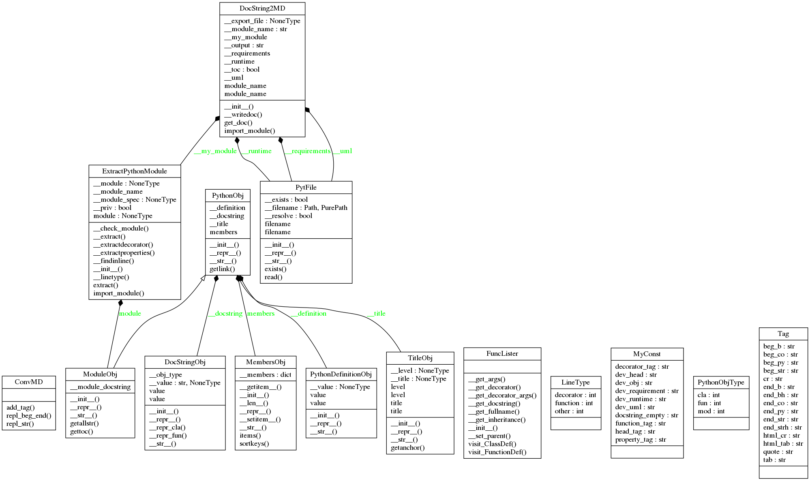

# docstring2md
## Description:

This package Export Google DocString to Markdown from Python module.

The following files comprise the `docstring2md` package:
* `LICENSE`: The license file. `docstring2md` is released under the terms of
the GNU General Public License (GPL), version 3.
* `README.md`: This readme file.
* `Makefile`: Generic management tasks.
* `setup.py`: Package and distribution management.
* `setup.cfg`: The setuptools setup file.

The package contents itself are in the `docstring2md` directory:
* `__init__.py` Initialization file for the Python package.
* `docstring2md/docstring2md.py`: The code of interest.

The script is in the `bin` directory:
* `export_docstring2md.py`: The script to run

## Setup:
```shell
git clone https://github.com/francois-le-ko4la/docstring-to-markdown.git
cd docstring-to-markdown
make install
```

## Test:

This module has been tested and validated on Ubuntu.
```shell
make test
```

## Use:

Use the script:
```shell
$ export_docstring2md.py -h
usage: export_docstring2md.py [-h] [-v] -i INPUT [-o FILE] [-t FILE] [-r FILE]

This script is provided by docstring2md package.
It exports google docstrings from python module to a Markdown file in order to
generate README.

optional arguments:
  -h, --help            show this help message and exit
  -v, --version         show program's version number and exit

required arguments:
  -i INPUT, --input INPUT
                        Input file name

optional arguments:
  -o FILE, --output FILE
                        Output file
  -t FILE, --runtime FILE
                        Runtime file
  -r FILE, --requirements FILE
                        requirements.txt file

Enjoy...
```

## Todo:

- [X] Create the project
- [X] Write code and tests
- [X] Test installation and requirements (setup.py and/or Makefile)
- [X] Test code
- [X] Validate features
- [X] Add-on : decorator
- [X] Add-on : class properties
- [X] Add-on : runtime & requirements
- [X] Add-on : toc
- [ ] Write Doc/stringdoc
- [X] Run PEP8 validation
- [ ] Clean & last check
- [ ] Release

## Note:
This script is free software; you can redistribute it and/or
modify it under the terms of the GNU Lesser General Public
License as published by the Free Software Foundation; either
version 3 of the License, or (at your option) any later version.

This script is provided in the hope that it will be useful,
but WITHOUT ANY WARRANTY; without even the implied warranty of
MERCHANTABILITY or FITNESS FOR A PARTICULAR PURPOSE.
## Dev notes
### Runtime

```
python-3.6.x

```
### Requirements

```
setuptools==36.2.7
pycodestyle==2.3.1

```
### UML Diagram


### Objects
[ConvMD()](#convmd)<br />
[ConvMD.add_tag(begin_tag, end_tag)](#convmdadd_tagbegin_tag-end_tag)<br />
[ConvMD.repl_beg_end(begin_regexp, end_regexp, begin_tag, end_tag)](#convmdrepl_beg_endbegin_regexp-end_regexp-begin_tag-end_tag)<br />
[ConvMD.repl_str(old_string, new_string)](#convmdrepl_strold_string-new_string)<br />
[DocString2MD()](#docstring2md)<br />
[@Property: DocString2MD.module_name](#property-docstring2mdmodule_name)<br />
[DocString2MD.__init__(self, module_name, export_file=None, runtime_file=None, requirements_file=None, uml_file=None, toc=True)](#docstring2mdinitself-module_name-export_filenone-runtime_filenone-requirements_filenone-uml_filenone-toctrue)<br />
[DocString2MD.__writedoc(self)](#docstring2md__writedocself)<br />
[DocString2MD.get_doc(self)](#docstring2mdget_docself)<br />
[DocString2MD.import_module(self)](#docstring2mdimport_moduleself)<br />
[DocStringObj()](#docstringobj)<br />
[@Property: DocStringObj.value](#property-docstringobjvalue)<br />
[DocStringObj.__init__(self, value)](#docstringobjinitself-value)<br />
[DocStringObj.__repr__(self)](#docstringobjreprself)<br />
[DocStringObj.__str__(self)](#docstringobjstrself)<br />
[ExtractPythonModule()](#extractpythonmodule)<br />
[ExtractPythonModule.__check_module(func)](#extractpythonmodule__check_modulefunc)<br />
[ExtractPythonModule.__extract(self, my_pythonobj, inspectmembers, level=0, decorator=None)](#extractpythonmodule__extractself-my_pythonobj-inspectmembers-level0-decoratornone)<br />
[ExtractPythonModule.__extractdecorator(self, member)](#extractpythonmodule__extractdecoratorself-member)<br />
[ExtractPythonModule.__extractproperties(self, my_pythonobj, inspectmembers, level, decorator, cls_name)](#extractpythonmodule__extractpropertiesself-my_pythonobj-inspectmembers-level-decorator-cls_name)<br />
[ExtractPythonModule.__findinline(self, line, search_item)](#extractpythonmodule__findinlineself-line-search_item)<br />
[ExtractPythonModule.__init__(self, module_name)](#extractpythonmoduleinitself-module_name)<br />
[ExtractPythonModule.__linetype(self, line)](#extractpythonmodule__linetypeself-line)<br />
[ExtractPythonModule.extract(self)](#extractpythonmoduleextractself)<br />
[ExtractPythonModule.import_module(self)](#extractpythonmoduleimport_moduleself)<br />
[LineType()](#linetype)<br />
[MembersObj()](#membersobj)<br />
[MembersObj.__getitem__(self, index)](#membersobjgetitemself-index)<br />
[MembersObj.__init__(self)](#membersobjinitself)<br />
[MembersObj.__len__(self)](#membersobjlenself)<br />
[MembersObj.__repr__(self)](#membersobjreprself)<br />
[MembersObj.__setitem__(self, index, value)](#membersobjsetitemself-index-value)<br />
[MembersObj.__str__(self)](#membersobjstrself)<br />
[MembersObj.items(self)](#membersobjitemsself)<br />
[MembersObj.sortkeys(self)](#membersobjsortkeysself)<br />
[ModuleObj()](#moduleobj)<br />
[ModuleObj.__init__(self, name, full_name, docstring, level=0)](#moduleobjinitself-name-full_name-docstring-level0)<br />
[ModuleObj.__repr__(self)](#moduleobjreprself)<br />
[ModuleObj.__str__(self)](#moduleobjstrself)<br />
[ModuleObj.getallstr(self, member=None)](#moduleobjgetallstrself-membernone)<br />
[ModuleObj.gettoc(self, member=None)](#moduleobjgettocself-membernone)<br />
[PythonObj.getlink(self)](#pythonobjgetlinkself)<br />
[MyConst()](#myconst)<br />
[PythonDefinitionObj()](#pythondefinitionobj)<br />
[@Property: PythonDefinitionObj.value](#property-pythondefinitionobjvalue)<br />
[PythonDefinitionObj.__init__(self, value)](#pythondefinitionobjinitself-value)<br />
[PythonDefinitionObj.__repr__(self)](#pythondefinitionobjreprself)<br />
[PythonDefinitionObj.__str__(self)](#pythondefinitionobjstrself)<br />
[PythonObj()](#pythonobj)<br />
[PythonObj.__init__(self, name, full_name, docstring, level)](#pythonobjinitself-name-full_name-docstring-level)<br />
[PythonObj.__repr__(self)](#pythonobjreprself)<br />
[PythonObj.__str__(self)](#pythonobjstrself)<br />
[PythonObj.getlink(self)](#pythonobjgetlinkself)<br />
[ReadFile()](#readfile)<br />
[@Property: ReadFile.filename](#property-readfilefilename)<br />
[ReadFile.__init__(self, filename)](#readfileinitself-filename)<br />
[ReadFile.__repr__(self)](#readfilereprself)<br />
[ReadFile.__str__(self)](#readfilestrself)<br />
[ReadFile.get(self)](#readfilegetself)<br />
[ReadFile.isdefined(self)](#readfileisdefinedself)<br />
[Tag()](#tag)<br />
[TitleObj()](#titleobj)<br />
[@Property: TitleObj.level](#property-titleobjlevel)<br />
[@Property: TitleObj.title](#property-titleobjtitle)<br />
[TitleObj.__init__(self, title, level)](#titleobjinitself-title-level)<br />
[TitleObj.__repr__(self)](#titleobjreprself)<br />
[TitleObj.__str__(self)](#titleobjstrself)<br />
[TitleObj.getanchor(self)](#titleobjgetanchorself)<br />
[wraps(wrapped, assigned=('__module__', '__name__', '__qualname__', '__doc__', '__annotations__'), updated=('__dict__',))](#wrapswrapped-assigned__module__-__name__-__qualname__-__doc__-__annotations__-updated__dict__)<br />


#### ConvMD()
```python
class ConvMD(object):
```
> <br />
> Prepare MD string<br />
> <br />
##### ConvMD.add_tag(begin_tag, end_tag)
```python
def ConvMD.add_tag(begin_tag, end_tag):
```
> <br />
> Decorator - add a tag<br />
> <br />
> <b>Example:</b><br />
> &nbsp;&nbsp;&nbsp;&nbsp;&nbsp;&nbsp;&nbsp;&nbsp;&nbsp;&nbsp;&nbsp;&nbsp;&nbsp;&nbsp;&nbsp;  ('__', '__') => __ TXT __<br />
> <br />
> <b>Args:</b><br />
> &nbsp;&nbsp;&nbsp;&nbsp;&nbsp;&nbsp;&nbsp;&nbsp;&nbsp;&nbsp;&nbsp;&nbsp;&nbsp;&nbsp;&nbsp;  beg_tag (str)<br />
> &nbsp;&nbsp;&nbsp;&nbsp;&nbsp;&nbsp;&nbsp;&nbsp;&nbsp;&nbsp;&nbsp;&nbsp;&nbsp;&nbsp;&nbsp;  end_tag (str)<br />
> <br />
> <b>Returns:</b><br />
> &nbsp;&nbsp;&nbsp;&nbsp;&nbsp;&nbsp;&nbsp;&nbsp;&nbsp;&nbsp;&nbsp;&nbsp;&nbsp;&nbsp;&nbsp;  decorated function<br />
> <br />
##### ConvMD.repl_beg_end(begin_regexp, end_regexp, begin_tag, end_tag)
```python
def ConvMD.repl_beg_end(begin_regexp, end_regexp, begin_tag, end_tag):
```
> <br />
> Decorator - replace the beggining and the end<br />
> <br />
> <b>Example:</b><br />
> &nbsp;&nbsp;&nbsp;&nbsp;&nbsp;&nbsp;&nbsp;&nbsp;&nbsp;&nbsp;&nbsp;&nbsp;&nbsp;&nbsp;&nbsp;  All new lines must be provided with a specific tag<br />
> &nbsp;&nbsp;&nbsp;&nbsp;&nbsp;&nbsp;&nbsp;&nbsp;&nbsp;&nbsp;&nbsp;&nbsp;&nbsp;&nbsp;&nbsp;  > 'Line' <br /><br />
> <br />
> <b>Args:</b><br />
> &nbsp;&nbsp;&nbsp;&nbsp;&nbsp;&nbsp;&nbsp;&nbsp;&nbsp;&nbsp;&nbsp;&nbsp;&nbsp;&nbsp;&nbsp;  begin_regexp (str)<br />
> &nbsp;&nbsp;&nbsp;&nbsp;&nbsp;&nbsp;&nbsp;&nbsp;&nbsp;&nbsp;&nbsp;&nbsp;&nbsp;&nbsp;&nbsp;  end_regexp (str)<br />
> &nbsp;&nbsp;&nbsp;&nbsp;&nbsp;&nbsp;&nbsp;&nbsp;&nbsp;&nbsp;&nbsp;&nbsp;&nbsp;&nbsp;&nbsp;  begin_tag (str)<br />
> &nbsp;&nbsp;&nbsp;&nbsp;&nbsp;&nbsp;&nbsp;&nbsp;&nbsp;&nbsp;&nbsp;&nbsp;&nbsp;&nbsp;&nbsp;  end_tag (str)<br />
> <br />
> <b>Returns:</b><br />
> &nbsp;&nbsp;&nbsp;&nbsp;&nbsp;&nbsp;&nbsp;&nbsp;&nbsp;&nbsp;&nbsp;&nbsp;&nbsp;&nbsp;&nbsp;  decorated function<br />
> <br />
##### ConvMD.repl_str(old_string, new_string)
```python
def ConvMD.repl_str(old_string, new_string):
```
> <br />
> Decorator - search & replace a string by another string<br />
> Example : replace space by a HTML tag.<br />
> <br />
> <b>Args:</b><br />
> &nbsp;&nbsp;&nbsp;&nbsp;&nbsp;&nbsp;&nbsp;&nbsp;&nbsp;&nbsp;&nbsp;&nbsp;&nbsp;&nbsp;&nbsp;  old_string (str): string to search<br />
> &nbsp;&nbsp;&nbsp;&nbsp;&nbsp;&nbsp;&nbsp;&nbsp;&nbsp;&nbsp;&nbsp;&nbsp;&nbsp;&nbsp;&nbsp;  new_string (str): new string<br />
> <br />
> <b>Returns:</b><br />
> &nbsp;&nbsp;&nbsp;&nbsp;&nbsp;&nbsp;&nbsp;&nbsp;&nbsp;&nbsp;&nbsp;&nbsp;&nbsp;&nbsp;&nbsp;  decorated function<br />
> <br />
#### DocString2MD()
```python
class DocString2MD(object):
```
> <br />
> Class DocString2MD : export Google docstring to MD File.<br />
> <br />
##### @Property: DocString2MD.module_name
```python
@property
def DocString2MD.module_name(self):
@module_name.setter
def DocString2MD.module_name(self, module_name):

```
> <br />
> @Property<br />
> <br />
##### DocString2MD.__init__(self, module_name, export_file=None, runtime_file=None, requirements_file=None, uml_file=None, toc=True)
```python
def DocString2MD.__init__(self, module_name, export_file=None, runtime_file=None, requirements_file=None, uml_file=None, toc=True):
```
> <br />
> Init the class<br />
> This function define default attributs.<br />
> <br />
> <b>Args:</b><br />
> &nbsp;&nbsp;&nbsp;&nbsp;&nbsp;&nbsp;&nbsp;&nbsp;&nbsp;&nbsp;&nbsp;&nbsp;&nbsp;&nbsp;&nbsp;  module_name (str): /path/to/the/module/<br />
> &nbsp;&nbsp;&nbsp;&nbsp;&nbsp;&nbsp;&nbsp;&nbsp;&nbsp;&nbsp;&nbsp;&nbsp;&nbsp;&nbsp;&nbsp;  export_file (str): /path/to/the/doc/file - None by default<br />
> <br />
> <b>Attributes:</b><br />
> &nbsp;&nbsp;&nbsp;&nbsp;&nbsp;&nbsp;&nbsp;&nbsp;&nbsp;&nbsp;&nbsp;&nbsp;&nbsp;&nbsp;&nbsp;  self.__export_file (str): /path/to/the/doc/file - None by default<br />
> &nbsp;&nbsp;&nbsp;&nbsp;&nbsp;&nbsp;&nbsp;&nbsp;&nbsp;&nbsp;&nbsp;&nbsp;&nbsp;&nbsp;&nbsp;  self.__my_module<br />
> &nbsp;&nbsp;&nbsp;&nbsp;&nbsp;&nbsp;&nbsp;&nbsp;&nbsp;&nbsp;&nbsp;&nbsp;&nbsp;&nbsp;&nbsp;  self.__output<br />
> <br />
> <b>Returns:</b><br />
> &nbsp;&nbsp;&nbsp;&nbsp;&nbsp;&nbsp;&nbsp;&nbsp;&nbsp;&nbsp;&nbsp;&nbsp;&nbsp;&nbsp;&nbsp;  obj<br />
> <br />
##### DocString2MD.__writedoc(self)
```python
def DocString2MD.__writedoc(self):
```
> <br />
> Writes the content in the file<br />
> <br />
> <b>args:</b><br />
> &nbsp;&nbsp;&nbsp;&nbsp;&nbsp;&nbsp;&nbsp;&nbsp;&nbsp;&nbsp;&nbsp;&nbsp;&nbsp;&nbsp;&nbsp;  None<br />
> <br />
> <b>Returns:</b><br />
> &nbsp;&nbsp;&nbsp;&nbsp;&nbsp;&nbsp;&nbsp;&nbsp;&nbsp;&nbsp;&nbsp;&nbsp;&nbsp;&nbsp;&nbsp;  bool: The return value. True for success, False otherwise.<br />
> <br />
##### DocString2MD.get_doc(self)
```python
def DocString2MD.get_doc(self):
```
> <br />
> Extract the doc<br />
> Returns self.__output or self.__writedoc<br />
> <br />
> <b>Args:</b><br />
> &nbsp;&nbsp;&nbsp;&nbsp;&nbsp;&nbsp;&nbsp;&nbsp;&nbsp;&nbsp;&nbsp;&nbsp;&nbsp;&nbsp;&nbsp;  None<br />
> <br />
> <b>Returns:</b><br />
> &nbsp;&nbsp;&nbsp;&nbsp;&nbsp;&nbsp;&nbsp;&nbsp;&nbsp;&nbsp;&nbsp;&nbsp;&nbsp;&nbsp;&nbsp;  str: self.__output<br />
> <br />
##### DocString2MD.import_module(self)
```python
def DocString2MD.import_module(self):
```
> <br />
> <b>- docstring empty -</b><br />
> <br />
#### DocStringObj()
```python
class DocStringObj(object):
```
> <br />
> String to store and prepare the docstring.<br />
> This object will become an attribute.<br />
> <br />
##### @Property: DocStringObj.value
```python
@property
def DocStringObj.value(self):
@value.setter
def DocStringObj.value(self, value):

```
> <br />
> @Property<br />
> <br />
##### DocStringObj.__init__(self, value)
```python
def DocStringObj.__init__(self, value):
```
> <br />
> Store the docstring<br />
> <br />
##### DocStringObj.__repr__(self)
```python
@ConvMD.repl_beg_end(Tag.beg_str, Tag.end_str, Tag.quote, Tag.html_cr)
@ConvMD.repl_beg_end(Tag.beg_str, Tag.end_strh, Tag.beg_b, Tag.end_bh)
@ConvMD.repl_str(Tag.tab, Tag.html_tab)
@ConvMD.add_tag(Tag.cr, Tag.cr)
def DocStringObj.__repr__(self):
```
> <br />
> Provide the new docstring with MD tags.<br />
> <br />
##### DocStringObj.__str__(self)
```python
def DocStringObj.__str__(self):
```
> <br />
> Call repr<br />
> <br />
#### ExtractPythonModule()
```python
class ExtractPythonModule(object):
```
> <br />
> Object in order to extract Python functions, classes....<br />
> <br />
##### ExtractPythonModule.__check_module(func)
```python
def ExtractPythonModule.__check_module(func):
```
> <br />
> Decorator - Checks if module can be imported.<br />
> Updates self.__module_spec in order to import the module.<br />
> <br />
> <b>Args:</b><br />
> &nbsp;&nbsp;&nbsp;&nbsp;&nbsp;&nbsp;&nbsp;&nbsp;&nbsp;&nbsp;&nbsp;&nbsp;&nbsp;&nbsp;&nbsp;  None<br />
> <br />
> <b>Retuns:</b><br />
> &nbsp;&nbsp;&nbsp;&nbsp;&nbsp;&nbsp;&nbsp;&nbsp;&nbsp;&nbsp;&nbsp;&nbsp;&nbsp;&nbsp;&nbsp;  bool: The return value. True for success, False otherwise.<br />
> <br />
##### ExtractPythonModule.__extract(self, my_pythonobj, inspectmembers, level=0, decorator=None)
```python
def ExtractPythonModule.__extract(self, my_pythonobj, inspectmembers, level=0, decorator=None):
```
> <br />
> Inspects classes & functions in a moddule.<br />
> Store information in a PythonObj object.<br />
> <br />
> <b>Args:</b><br />
> &nbsp;&nbsp;&nbsp;&nbsp;&nbsp;&nbsp;&nbsp;&nbsp;&nbsp;&nbsp;&nbsp;&nbsp;&nbsp;&nbsp;&nbsp;  inspectmembers (obj): inspect obect<br />
> &nbsp;&nbsp;&nbsp;&nbsp;&nbsp;&nbsp;&nbsp;&nbsp;&nbsp;&nbsp;&nbsp;&nbsp;&nbsp;&nbsp;&nbsp;  my_pythonobj (PythonObj): object to define a Python member<br />
> <br />
> <b>Returns:</b><br />
> &nbsp;&nbsp;&nbsp;&nbsp;&nbsp;&nbsp;&nbsp;&nbsp;&nbsp;&nbsp;&nbsp;&nbsp;&nbsp;&nbsp;&nbsp;  None<br />
> <br />
##### ExtractPythonModule.__extractdecorator(self, member)
```python
def ExtractPythonModule.__extractdecorator(self, member):
```
> <br />
> <b>- docstring empty -</b><br />
> <br />
##### ExtractPythonModule.__extractproperties(self, my_pythonobj, inspectmembers, level, decorator, cls_name)
```python
def ExtractPythonModule.__extractproperties(self, my_pythonobj, inspectmembers, level, decorator, cls_name):
```
> <br />
> <b>- docstring empty -</b><br />
> <br />
##### ExtractPythonModule.__findinline(self, line, search_item)
```python
def ExtractPythonModule.__findinline(self, line, search_item):
```
> <br />
> <b>- docstring empty -</b><br />
> <br />
##### ExtractPythonModule.__init__(self, module_name)
```python
def ExtractPythonModule.__init__(self, module_name):
```
> <br />
> Init<br />
> <br />
##### ExtractPythonModule.__linetype(self, line)
```python
def ExtractPythonModule.__linetype(self, line):
```
> <br />
> <b>- docstring empty -</b><br />
> <br />
##### ExtractPythonModule.extract(self)
```python
def ExtractPythonModule.extract(self):
```
> <br />
> Defines module object and extracts all members.<br />
> <br />
> <b>Args:</b><br />
> &nbsp;&nbsp;&nbsp;&nbsp;&nbsp;&nbsp;&nbsp;&nbsp;&nbsp;&nbsp;&nbsp;&nbsp;&nbsp;&nbsp;&nbsp;  None<br />
> <br />
> <b>Returns:</b><br />
> &nbsp;&nbsp;&nbsp;&nbsp;&nbsp;&nbsp;&nbsp;&nbsp;&nbsp;&nbsp;&nbsp;&nbsp;&nbsp;&nbsp;&nbsp;  None<br />
> <br />
##### ExtractPythonModule.import_module(self)
```python
@__check_module
def ExtractPythonModule.import_module(self):
```
> <br />
> Check module<br />
> Import the module via the passed in module specification<br />
> Returns the newly imported module and updates attributes self.__module<br />
> <br />
> <b>Args:</b><br />
> &nbsp;&nbsp;&nbsp;&nbsp;&nbsp;&nbsp;&nbsp;&nbsp;&nbsp;&nbsp;&nbsp;&nbsp;&nbsp;&nbsp;&nbsp;  None<br />
> <br />
> <b>Returns:</b><br />
> &nbsp;&nbsp;&nbsp;&nbsp;&nbsp;&nbsp;&nbsp;&nbsp;&nbsp;&nbsp;&nbsp;&nbsp;&nbsp;&nbsp;&nbsp;  bool: The return value. True for success, False otherwise.<br />
> <br />
#### LineType()
```python
class LineType:
```
> <br />
> <b>- docstring empty -</b><br />
> <br />
#### MembersObj()
```python
class MembersObj(object):
```
> <br />
> Dict() to store a python object's members.<br />
> This object will become an attribute.<br />
> <br />
##### MembersObj.__getitem__(self, index)
```python
def MembersObj.__getitem__(self, index):
```
> <br />
> <b>- docstring empty -</b><br />
> <br />
##### MembersObj.__init__(self)
```python
def MembersObj.__init__(self):
```
> <br />
> Initialize self.  See help(type(self)) for accurate signature.<br />
> <br />
##### MembersObj.__len__(self)
```python
def MembersObj.__len__(self):
```
> <br />
> <b>- docstring empty -</b><br />
> <br />
##### MembersObj.__repr__(self)
```python
def MembersObj.__repr__(self):
```
> <br />
> Return repr(self).<br />
> <br />
##### MembersObj.__setitem__(self, index, value)
```python
def MembersObj.__setitem__(self, index, value):
```
> <br />
> <b>- docstring empty -</b><br />
> <br />
##### MembersObj.__str__(self)
```python
def MembersObj.__str__(self):
```
> <br />
> Return str(self).<br />
> <br />
##### MembersObj.items(self)
```python
def MembersObj.items(self):
```
> <br />
> <b>- docstring empty -</b><br />
> <br />
##### MembersObj.sortkeys(self)
```python
def MembersObj.sortkeys(self):
```
> <br />
> <b>- docstring empty -</b><br />
> <br />
#### ModuleObj()
```python
class ModuleObj(PythonObj):
```
> <br />
> Class in order to register module informations<br />
> __str__ is used to export with MD format.<br />
> <br />
##### ModuleObj.__init__(self, name, full_name, docstring, level=0)
```python
def ModuleObj.__init__(self, name, full_name, docstring, level=0):
```
> <br />
> Initialize self.  See help(type(self)) for accurate signature.<br />
> <br />
##### ModuleObj.__repr__(self)
```python
def ModuleObj.__repr__(self):
```
> <br />
> Return repr(self).<br />
> <br />
##### ModuleObj.__str__(self)
```python
def ModuleObj.__str__(self):
```
> <br />
> Return str(self).<br />
> <br />
##### ModuleObj.getallstr(self, member=None)
```python
def ModuleObj.getallstr(self, member=None):
```
> <br />
> <b>- docstring empty -</b><br />
> <br />
##### ModuleObj.gettoc(self, member=None)
```python
def ModuleObj.gettoc(self, member=None):
```
> <br />
> <b>- docstring empty -</b><br />
> <br />
##### PythonObj.getlink(self)
```python
def PythonObj.getlink(self):
```
> <br />
> <b>- docstring empty -</b><br />
> <br />
#### MyConst()
```python
class MyConst:
```
> <br />
> <b>- docstring empty -</b><br />
> <br />
#### PythonDefinitionObj()
```python
class PythonDefinitionObj(object):
```
> <br />
> <b>String so store and prepare the object definition:</b><br />
> Example : def function_name(*args)<br />
> This object will become an attribute.<br />
> <br />
##### @Property: PythonDefinitionObj.value
```python
@property
def PythonDefinitionObj.value(self):
@value.setter
def PythonDefinitionObj.value(self, value):

```
> <br />
> @Property<br />
> <br />
##### PythonDefinitionObj.__init__(self, value)
```python
def PythonDefinitionObj.__init__(self, value):
```
> <br />
> Initialize self.  See help(type(self)) for accurate signature.<br />
> <br />
##### PythonDefinitionObj.__repr__(self)
```python
@ConvMD.add_tag(Tag.beg_py, Tag.end_py)
def PythonDefinitionObj.__repr__(self):
```
> <br />
> Provide the definition string with MD tags.<br />
> <br />
##### PythonDefinitionObj.__str__(self)
```python
def PythonDefinitionObj.__str__(self):
```
> <br />
> Call repr<br />
> <br />
#### PythonObj()
```python
class PythonObj(object):
```
> <br />
> Class in order to register object informations<br />
> __str__ is used to export with MD format.<br />
> <br />
##### PythonObj.__init__(self, name, full_name, docstring, level)
```python
def PythonObj.__init__(self, name, full_name, docstring, level):
```
> <br />
> Initialize self.  See help(type(self)) for accurate signature.<br />
> <br />
##### PythonObj.__repr__(self)
```python
def PythonObj.__repr__(self):
```
> <br />
> Return repr(self).<br />
> <br />
##### PythonObj.__str__(self)
```python
def PythonObj.__str__(self):
```
> <br />
> Return str(self).<br />
> <br />
##### PythonObj.getlink(self)
```python
def PythonObj.getlink(self):
```
> <br />
> <b>- docstring empty -</b><br />
> <br />
#### ReadFile()
```python
class ReadFile(object):
```
> <br />
> <b>- docstring empty -</b><br />
> <br />
##### @Property: ReadFile.filename
```python
@property
def ReadFile.filename(self):
@filename.setter
def ReadFile.filename(self, filename):

```
> <br />
> @Property<br />
> <br />
##### ReadFile.__init__(self, filename)
```python
def ReadFile.__init__(self, filename):
```
> <br />
> Initialize self.  See help(type(self)) for accurate signature.<br />
> <br />
##### ReadFile.__repr__(self)
```python
def ReadFile.__repr__(self):
```
> <br />
> Return repr(self).<br />
> <br />
##### ReadFile.__str__(self)
```python
def ReadFile.__str__(self):
```
> <br />
> Return str(self).<br />
> <br />
##### ReadFile.get(self)
```python
def ReadFile.get(self):
```
> <br />
> open & read the file<br />
> Returns the content<br />
> <br />
##### ReadFile.isdefined(self)
```python
def ReadFile.isdefined(self):
```
> <br />
> <b>- docstring empty -</b><br />
> <br />
#### Tag()
```python
class Tag:
```
> <br />
> <b>- docstring empty -</b><br />
> <br />
#### TitleObj()
```python
class TitleObj(object):
```
> <br />
> String to store and prepare MD title<br />
> This object will become an attribute.<br />
> <br />
##### @Property: TitleObj.level
```python
@property
def TitleObj.level(self):
@level.setter
def TitleObj.level(self, level):

```
> <br />
> @Property<br />
> <br />
##### @Property: TitleObj.title
```python
@property
def TitleObj.title(self):
@title.setter
def TitleObj.title(self, title):

```
> <br />
> @Property<br />
> <br />
##### TitleObj.__init__(self, title, level)
```python
def TitleObj.__init__(self, title, level):
```
> <br />
> Init => store the sting in value and level (H1/H2/H3/...)<br />
> <br />
##### TitleObj.__repr__(self)
```python
def TitleObj.__repr__(self):
```
> <br />
> Provide the MD string according to the level<br />
> <br />
##### TitleObj.__str__(self)
```python
def TitleObj.__str__(self):
```
> <br />
> Return str(self).<br />
> <br />
##### TitleObj.getanchor(self)
```python
def TitleObj.getanchor(self):
```
> <br />
> <b>- docstring empty -</b><br />
> <br />
#### wraps(wrapped, assigned=('__module__', '__name__', '__qualname__', '__doc__', '__annotations__'), updated=('__dict__',))
```python
def wraps(wrapped, assigned=('__module__', '__name__', '__qualname__', '__doc__', '__annotations__'), updated=('__dict__',)):
```
> <br />
> Decorator factory to apply update_wrapper() to a wrapper function<br />
> <br />
> Returns a decorator that invokes update_wrapper() with the decorated<br />
> function as the wrapper argument and the arguments to wraps() as the<br />
> remaining arguments. Default arguments are as for update_wrapper().<br />
> This is a convenience function to simplify applying partial() to<br />
> update_wrapper().<br />
> <br />
