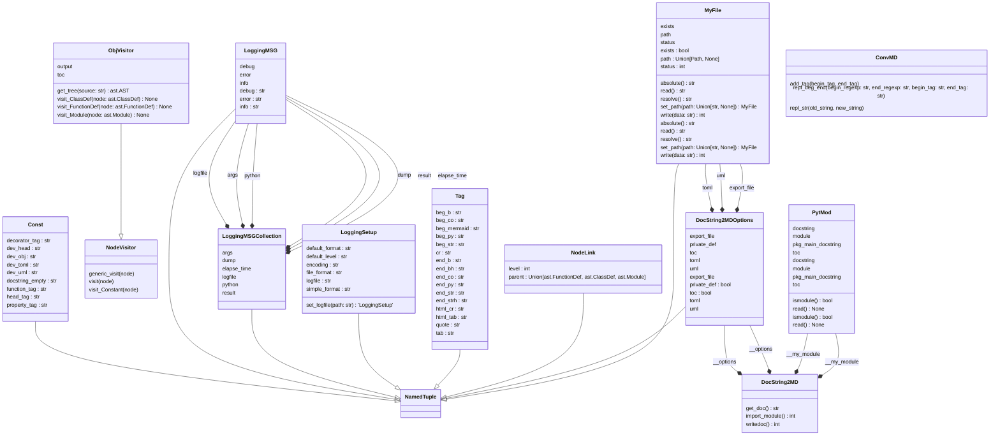

# docstring2md
[]()


## Description:

Generating documentation from code can be a tedious and time-consuming task.
By offering a simple and easy-to-use tool, this package aims to make the
process of creating documentation more efficient. It allows users to extract
useful information, such as function descriptions and input/output
specifications, directly from the source code (Google DocStrings). This can
save a  lot of time  and effort that would otherwise be spent manually
writing documentation. In addition, having documentation automatically
generated from code ensures that it stays up-to-date as the codebase
changes. Overall, this package provides a convenient solution for generating
high-quality documentation for Python projects.

## Why ?:

We can find a lot of tools to generate docs from code but we want something
quick and easy to setup.
This tool can be used on python file or python package.

Semantic analysis and tree traversal are not really my passions ^^, but these
types of tools are still very interesting. Some time has passed since the
first version. I admit that Python had started to introduce typing but it was
not yet widespread. There have also been significant changes in the deployment
of packages, and since the script setup.py has no reason to exist. I have
therefore migrated to the TOML file and adapted the META import libraries.
It's true that I might have done this sooner, but I ran out of time and was
 always using somewhat outdated versions of Python. Changes in the language are
 constant. This new version is therefore a complete refresh, allowing me to be
 more in line with what is currently being done in the Python ecosystem.

## Setup:
```shell
$ git clone https://github.com/francois-le-ko4la/docstring-to-markdown.git
$ cd docstring-to-markdown
$ make install
```

## Test:

This module has been tested and validated on Ubuntu 17.10/18.04.
```shell
$ make test
```

## Use:

Use the script:
```shell
Usage: export_docstring2md [-h] [--version] [--debug | --quiet]
                           [--logfile LOGFILE] [--toc] [--private-def] -p
                           PACKAGE [-o OUTPUT_FILE] [-t TOML_FILE]
                           [-mmd MERMAID_FILE]

This script is provided by docstring2md package.
It exports google docstrings from python module to a Markdown file in order to
generate README.

Options:
  -h, --help            show this help message and exit
  --version             show program's version number and exit
  --debug               print debug messages to stderr
  --quiet               print error messages to stderr
  --logfile LOGFILE     /path/to/file.log
  --toc                 Enable the table of contents
  --private-def         Enable the table of contents

Required Arguments:
  -p, --package PACKAGE
                        define the /path/to/the/package or <package_name>

Optional Arguments:
  -o, --output-file OUTPUT_FILE
                        /path/to/output/file (README.md)
  -t, --toml-file TOML_FILE
                        /path/to/runtime/file
  -mmd, --mermaid-file MERMAID_FILE
                        /path/to/mermaid/file.mmd

COMPATIBILITY:
    Python 3.7+ - https://www.python.org/

EXIT STATUS:
    This script exits 0 on success, and >0 if an error occurs.
```

## Todo:

- [X] Create the project
- [X] Write code and tests
- [X] Test installation and requirements (setup.py and/or Makefile)
- [X] Test code
- [X] Validate features
- [X] Add-on : decorator
- [X] Add-on : class properties
- [X] Add-on : runtime & requirements
- [X] Add-on : toc
- [X] Add-on : remove inspect library and use AST
- [X] Add-on : improve global performance (x3)
- [X] Write Doc/stringdoc
- [X] Run PEP8 validation
- [X] Clean & last check
- [X] Release 0.4.1
- [X] Rebuild the cli argument
- [X] Rebuild logging management and add more debug
- [X] Rebuild the package management through pyproject.toml
- [X] Rebuild the Makefile
- [X] Add-on : typing
- [ ] Finish the typing
- [ ] AST optimisation
- [ ] Improve CONST
- [ ] Release 0.5.0

## License

This package is distributed under the [GPLv3 license](./LICENSE)
## Dev notes
### TOML file:

```

# -*- coding: utf-8 -*-
[project]
name = "docstring2md"
version = "0.5.0"
authors = [
  {name = "ko4la" }
]
description = "Docstring extractor to generate readme."
requires-python = ">=3.7"
classifiers = [
    "Development Status :: 5 - Stable",
    "Environment :: Console",
    "Intended Audience :: Developers",
    "Programming Language :: Python :: 3",
    "Programming Language :: Python :: 3.7",
    "Programming Language :: Python :: 3.8",
    "Programming Language :: Python :: 3.9",
    "Programming Language :: Python :: 3.10",
    "Programming Language :: Python :: 3.11",
    "Programming Language :: Python :: 3 :: Only",
]
dependencies = [
    "pycodestyle>=2.3.1",
    "PyYAML>=3.12",
    "rich>=12.6.0",
    "rich_argparse>=0.6.0",
    "importlib-metadata ~= 1.0 ; python_version < '3.8'"
    ]

[project.optional-dependencies]
dev = [
    "pytest>=7.2.0",
    "pylint",
    "mypy",
    "pytest-pylint",
    "pytest-pycodestyle",
    "pytest-mypy",
    "types-setuptools",
    "types-PyYAML"]

[project.scripts]
export_docstring2md = "docstring2md.cli:run"

[build-system]
requires = ["setuptools"]
build-backend = "setuptools.build_meta"

[tool.pytest.ini_options]
minversion = "7.2"
addopts = "-v -rfEX --pycodestyle --doctest-modules --mypy --pylint --strict-markers"
python_files = ["docstring2md/*.py"]
xfail_strict = true
filterwarnings = [
    "ignore:.*U.*mode is deprecated:DeprecationWarning",
    "ignore::DeprecationWarning"]
[tool.mypy]
mypy_path = "$MYPY_CONFIG_FILE_DIR/stubs"


```

### UML Diagram:



### Objects:

#### NodeLink()
```python
class NodeLink(NamedTuple):
```

```
NamedTuple to link a node with a parent Node
```

#### ObjVisitor()
```python
class ObjVisitor():
```

```
This Class is an ast.NodeVisitor class and allow us to parse
code tree.
All methods are called according to node type.
We define other private method in order to manage string format.
We use decorator to keep a clean code without MD Tag.

ObjVisitor(module_docstring=True|False)
    module_docstring: true => retrieve the module docstring
    This parameter is usefull to use the first docstring module
    in a package.

Use:
    >>> from docstring2md.file import MyFile
    >>> import pathlib
    >>> module = str(pathlib.Path(__file__).resolve())
    >>> source = MyFile.set_path(module)
    >>> # init
    >>> doc = ObjVisitor(module_docstring=False)
    >>> # provide source, generate the tree and use visit mechanisme
    >>> doc.visit(doc.get_tree(source.read()))
    >>> result = doc.output
    >>> result = result.split("\n")
    >>> result[0]
    '#### NodeLink()'
```

##### ObjVisitor.__init__()
```python
def ObjVisitor.__init__(self, module_docstring: bool=False, priv: bool=False) -> None:
```
> <br />
> None<br />
> <br />
##### @Property ObjVisitor.toc
```python
@property
def ObjVisitor.toc(self) -> str:
```
> <br />
> Return toc property<br />
> <br />
##### @Property ObjVisitor.output
```python
@property
def ObjVisitor.output(self) -> str:
```
> <br />
> Return output property<br />
> <br />
##### ObjVisitor.get_tree()
```python
@staticmethod
def ObjVisitor.get_tree(source: str) -> ast.AST:
```
> <br />
> This function allow us to parse the source and build the<br />
> tree.<br />
> We put this function to group all AST function in this<br />
> module.<br />
> <br />
> <b>Args:</b><br />
> &nbsp;&nbsp;&nbsp;&nbsp;&nbsp;&nbsp;&nbsp;&nbsp;&nbsp;&nbsp;&nbsp;&nbsp;&nbsp;&nbsp;&nbsp;  source (str): source code<br />
> <br />
> <b>Returns:</b><br />
> &nbsp;&nbsp;&nbsp;&nbsp;&nbsp;&nbsp;&nbsp;&nbsp;&nbsp;&nbsp;&nbsp;&nbsp;&nbsp;&nbsp;&nbsp;  AST tree<br />
> <br />
##### ObjVisitor.__set_level()
```python
def ObjVisitor.__set_level(self, node, level=0, parent=None) -> None:
```
> <br />
> None<br />
> <br />
##### ObjVisitor.visit_Module()
```python
def ObjVisitor.visit_Module(self, node: ast.Module) -> None:
```
> <br />
> This function is automatically called by AST mechanisme<br />
> when the current node is a module.<br />
> We update self.output.<br />
> <br />
> <b>Args:</b><br />
> &nbsp;&nbsp;&nbsp;&nbsp;&nbsp;&nbsp;&nbsp;&nbsp;&nbsp;&nbsp;&nbsp;&nbsp;&nbsp;&nbsp;&nbsp;  node (ast.AST): current node<br />
> <br />
> <b>Returns:</b><br />
> &nbsp;&nbsp;&nbsp;&nbsp;&nbsp;&nbsp;&nbsp;&nbsp;&nbsp;&nbsp;&nbsp;&nbsp;&nbsp;&nbsp;&nbsp;  None.<br />
> <br />
##### ObjVisitor.__add_toc()
```python
def ObjVisitor.__add_toc(self, title: str) -> None:
```
> <br />
> None<br />
> <br />
##### ObjVisitor.__get_args()
```python
@staticmethod
def ObjVisitor.__get_args(node: ast.FunctionDef) -> str:
```
> <br />
> None<br />
> <br />
##### ObjVisitor.__get_decorator_args()
```python
@staticmethod
def ObjVisitor.__get_decorator_args(node: list[ast.expr]) -> str:
```
> <br />
> None<br />
> <br />
##### ObjVisitor.__get_decorator()
```python
def ObjVisitor.__get_decorator(self, node: ast.FunctionDef) -> list:
```
> <br />
> None<br />
> <br />
##### ObjVisitor.__get_fullname()
```python
def ObjVisitor.__get_fullname(self, node: Union[ast.FunctionDef, ast.ClassDef]) -> str:
```
> <br />
> None<br />
> <br />
##### ObjVisitor.__get_docstring()
```python
@staticmethod
def ObjVisitor.__get_docstring(node: ast.Module):
```
> <br />
> None<br />
> <br />
##### ObjVisitor.__get_cla_docstring()
```python
@ConvMD.add_tag(TAG.beg_co, TAG.end_co)
def ObjVisitor.__get_cla_docstring(self, node: ast.ClassDef):
```
> <br />
> None<br />
> <br />
##### ObjVisitor.__get_func_docstring()
```python
@ConvMD.repl_beg_end(TAG.beg_str, TAG.end_str, TAG.quote, TAG.html_cr)
@ConvMD.repl_beg_end(TAG.beg_str, TAG.end_strh, TAG.beg_b, TAG.end_bh)
@ConvMD.repl_str(TAG.tab, TAG.html_tab)
@ConvMD.add_tag(TAG.cr, TAG.cr)
def ObjVisitor.__get_func_docstring(self, node: ast.FunctionDef):
```
> <br />
> None<br />
> <br />
##### ObjVisitor.__get_func_title()
```python
def ObjVisitor.__get_func_title(self, node: ast.FunctionDef) -> str:
```
> <br />
> None<br />
> <br />
##### ObjVisitor.__get_func_return()
```python
@staticmethod
def ObjVisitor.__get_func_return(node: ast.FunctionDef) -> str:
```
> <br />
> None<br />
> <br />
##### ObjVisitor.__get_func_def()
```python
@ConvMD.add_tag(TAG.beg_py, TAG.end_py)
def ObjVisitor.__get_func_def(self, node: ast.FunctionDef) -> str:
```
> <br />
> None<br />
> <br />
##### ObjVisitor.__get_cla_title()
```python
def ObjVisitor.__get_cla_title(self, node: ast.ClassDef) -> str:
```
> <br />
> None<br />
> <br />
##### ObjVisitor.__get_cla_def()
```python
@ConvMD.add_tag(TAG.beg_py, TAG.end_py)
def ObjVisitor.__get_cla_def(self, node: ast.ClassDef) -> str:
```
> <br />
> None<br />
> <br />
##### ObjVisitor.__get_inheritance()
```python
@staticmethod
def ObjVisitor.__get_inheritance(node: ast.ClassDef) -> str:
```
> <br />
> None<br />
> <br />
##### ObjVisitor.visit_ClassDef()
```python
def ObjVisitor.visit_ClassDef(self, node: ast.ClassDef) -> None:
```
> <br />
> This function is automatically called by AST mechanisme<br />
> when the current node is a class.<br />
> We update self.output.<br />
> <br />
> <b>Args:</b><br />
> &nbsp;&nbsp;&nbsp;&nbsp;&nbsp;&nbsp;&nbsp;&nbsp;&nbsp;&nbsp;&nbsp;&nbsp;&nbsp;&nbsp;&nbsp;  node (ast): current node<br />
> <br />
> <b>Returns:</b><br />
> &nbsp;&nbsp;&nbsp;&nbsp;&nbsp;&nbsp;&nbsp;&nbsp;&nbsp;&nbsp;&nbsp;&nbsp;&nbsp;&nbsp;&nbsp;  None.<br />
> <br />
##### ObjVisitor.__valid_name()
```python
def ObjVisitor.__valid_name(self, node: ast.FunctionDef) -> bool:
```
> <br />
> None<br />
> <br />
##### ObjVisitor.visit_FunctionDef()
```python
def ObjVisitor.visit_FunctionDef(self, node: ast.FunctionDef) -> None:
```
> <br />
> This function is automatically called by AST mechanisme<br />
> when the current node is a function.<br />
> We update self.output.<br />
> <br />
> <b>Args:</b><br />
> &nbsp;&nbsp;&nbsp;&nbsp;&nbsp;&nbsp;&nbsp;&nbsp;&nbsp;&nbsp;&nbsp;&nbsp;&nbsp;&nbsp;&nbsp;  node (ast.AST): current node<br />
> <br />
> <b>Returns:</b><br />
> &nbsp;&nbsp;&nbsp;&nbsp;&nbsp;&nbsp;&nbsp;&nbsp;&nbsp;&nbsp;&nbsp;&nbsp;&nbsp;&nbsp;&nbsp;  None.<br />
> <br />
#### check_python()
```python
def check_python() -> bool:
```
> <br />
> This function check Python version, log the result and return a status<br />
> True/False.<br />
> <br />
> <b>Returns:</b><br />
> &nbsp;&nbsp;&nbsp;&nbsp;&nbsp;&nbsp;&nbsp;&nbsp;&nbsp;&nbsp;&nbsp;&nbsp;&nbsp;&nbsp;&nbsp;  True if successful, False otherwise.<br />
> <br />
#### get_argparser()
```python
def get_argparser() -> argparse.ArgumentParser:
```
> <br />
> This function describe the argument parser and return it.<br />
> <br />
> <b>Returns:</b><br />
> &nbsp;&nbsp;&nbsp;&nbsp;&nbsp;&nbsp;&nbsp;&nbsp;&nbsp;&nbsp;&nbsp;&nbsp;&nbsp;&nbsp;&nbsp;  ArgumentParser<br />
> <br />
> <b>Examples:</b><br />
> >>> a = get_argparser()<br />
> >>> type(a)<br />
> <class 'argparse.ArgumentParser'><br />
> <br />
#### run()
```python
def run() -> int:
```
> <br />
> This function is called by the CLI runner and manage options.<br />
> <br />
> <b>Args:</b><br />
> &nbsp;&nbsp;&nbsp;&nbsp;&nbsp;&nbsp;&nbsp;&nbsp;&nbsp;&nbsp;&nbsp;&nbsp;&nbsp;&nbsp;&nbsp;  None.<br />
> <br />
> <b>Returns:</b><br />
> &nbsp;&nbsp;&nbsp;&nbsp;&nbsp;&nbsp;&nbsp;&nbsp;&nbsp;&nbsp;&nbsp;&nbsp;&nbsp;&nbsp;&nbsp;  print screen|file<br />
> <br />
#### ConvMD()
```python
class ConvMD():
```

```
Prepare MD string
```

##### ConvMD.repl_str()
```python
@staticmethod
def ConvMD.repl_str(old_string, new_string):
```
> <br />
> Decorator - search & replace a string by another string<br />
> Examples: replace space by a HTML tag.<br />
> <br />
> <b>Args:</b><br />
> &nbsp;&nbsp;&nbsp;&nbsp;&nbsp;&nbsp;&nbsp;&nbsp;&nbsp;&nbsp;&nbsp;&nbsp;&nbsp;&nbsp;&nbsp;  old_string (str): string to search<br />
> &nbsp;&nbsp;&nbsp;&nbsp;&nbsp;&nbsp;&nbsp;&nbsp;&nbsp;&nbsp;&nbsp;&nbsp;&nbsp;&nbsp;&nbsp;  new_string (str): new string<br />
> <br />
> <b>Returns:</b><br />
> &nbsp;&nbsp;&nbsp;&nbsp;&nbsp;&nbsp;&nbsp;&nbsp;&nbsp;&nbsp;&nbsp;&nbsp;&nbsp;&nbsp;&nbsp;  decorated function<br />
> <br />
###### ConvMD.repl_str.tags_decorator()
```python
def ConvMD.repl_str.tags_decorator(func):
```
> <br />
> decorator <br />
> <br />
####### ConvMD.repl_str.tags_decorator.func_wrapper()
```python
@wraps(func)
def ConvMD.repl_str.tags_decorator.func_wrapper(*args, **kwargs):
```
> <br />
> wrapper <br />
> <br />
##### ConvMD.repl_beg_end()
```python
@staticmethod
def ConvMD.repl_beg_end(begin_regexp: str, end_regexp: str, begin_tag: str, end_tag: str):
```
> <br />
> Decorator - replace the beggining and the end<br />
> <br />
> <b>Args:</b><br />
> &nbsp;&nbsp;&nbsp;&nbsp;&nbsp;&nbsp;&nbsp;&nbsp;&nbsp;&nbsp;&nbsp;&nbsp;&nbsp;&nbsp;&nbsp;  begin_regexp (str)<br />
> &nbsp;&nbsp;&nbsp;&nbsp;&nbsp;&nbsp;&nbsp;&nbsp;&nbsp;&nbsp;&nbsp;&nbsp;&nbsp;&nbsp;&nbsp;  end_regexp (str)<br />
> &nbsp;&nbsp;&nbsp;&nbsp;&nbsp;&nbsp;&nbsp;&nbsp;&nbsp;&nbsp;&nbsp;&nbsp;&nbsp;&nbsp;&nbsp;  begin_tag (str)<br />
> &nbsp;&nbsp;&nbsp;&nbsp;&nbsp;&nbsp;&nbsp;&nbsp;&nbsp;&nbsp;&nbsp;&nbsp;&nbsp;&nbsp;&nbsp;  end_tag (str)<br />
> <br />
> <b>Returns:</b><br />
> &nbsp;&nbsp;&nbsp;&nbsp;&nbsp;&nbsp;&nbsp;&nbsp;&nbsp;&nbsp;&nbsp;&nbsp;&nbsp;&nbsp;&nbsp;  decorated function<br />
> <br />
> <b>Examples:</b><br />
> &nbsp;&nbsp;&nbsp;&nbsp;&nbsp;&nbsp;&nbsp;&nbsp;&nbsp;&nbsp;&nbsp;&nbsp;&nbsp;&nbsp;&nbsp;  All new lines must be provided with a specific tag<br />
> &nbsp;&nbsp;&nbsp;&nbsp;&nbsp;&nbsp;&nbsp;&nbsp;&nbsp;&nbsp;&nbsp;&nbsp;&nbsp;&nbsp;&nbsp;  > 'Line' <br /><br />
> <br />
###### ConvMD.repl_beg_end.tags_decorator()
```python
def ConvMD.repl_beg_end.tags_decorator(func):
```
> <br />
> decorator <br />
> <br />
####### ConvMD.repl_beg_end.tags_decorator.func_wrapper()
```python
@wraps(func)
def ConvMD.repl_beg_end.tags_decorator.func_wrapper(*args, **kwargs):
```
> <br />
> wrapper <br />
> <br />
##### ConvMD.add_tag()
```python
@staticmethod
def ConvMD.add_tag(begin_tag, end_tag):
```
> <br />
> Decorator - add a tag<br />
> <br />
> <b>Args:</b><br />
> &nbsp;&nbsp;&nbsp;&nbsp;&nbsp;&nbsp;&nbsp;&nbsp;&nbsp;&nbsp;&nbsp;&nbsp;&nbsp;&nbsp;&nbsp;  begin_tag (str)<br />
> &nbsp;&nbsp;&nbsp;&nbsp;&nbsp;&nbsp;&nbsp;&nbsp;&nbsp;&nbsp;&nbsp;&nbsp;&nbsp;&nbsp;&nbsp;  end_tag (str)<br />
> <br />
> <b>Returns:</b><br />
> &nbsp;&nbsp;&nbsp;&nbsp;&nbsp;&nbsp;&nbsp;&nbsp;&nbsp;&nbsp;&nbsp;&nbsp;&nbsp;&nbsp;&nbsp;  decorated function<br />
> <br />
> <b>Examples:</b><br />
> &nbsp;&nbsp;&nbsp;&nbsp;&nbsp;&nbsp;&nbsp;&nbsp;&nbsp;&nbsp;&nbsp;&nbsp;&nbsp;&nbsp;&nbsp;  ('__', '__') => __ TXT __<br />
> <br />
###### ConvMD.add_tag.tags_decorator()
```python
def ConvMD.add_tag.tags_decorator(func):
```
> <br />
> decorator <br />
> <br />
####### ConvMD.add_tag.tags_decorator.func_wrapper()
```python
@wraps(func)
def ConvMD.add_tag.tags_decorator.func_wrapper(*args):
```
> <br />
> wrapper <br />
> <br />
#### DocString2MDOptions()
```python
class DocString2MDOptions(NamedTuple):
```

```
This NamedTuple organizes all options with one NamedTuple
    export_file (str): /path/to/doc/file - None by default
    runtime_file (str): /path/to/runtime/file - None by default
    requirements_file (str): /path/to/requiremnt/file - None by default
    uml_file (str): /path/to/uml/file - None by default
    toc (bool): True -> get a table of content
    priv (bool): True -> get private function
```

#### DocString2MD()
```python
class DocString2MD():
```

```
Class DocString2MD : export Google docstring to MD File.

Use:
    >>> options: DocString2MDOptions = DocString2MDOptions(                    toml=MyFile.set_path(None),                    uml=MyFile.set_path(None),                    export_file=MyFile.set_path(None),                    toc=False,                    private_def=False)
    >>> doc = DocString2MD("oups", options)
    >>> doc.import_module()
    72
    >>> doc = DocString2MD("docstring2md", options)
    >>> doc.import_module()
    0
    >>> result = doc.get_doc()
    >>> result = result.split("\n")
    >>> print(result[0])
    # docstring2md
```

##### DocString2MD.__init__()
```python
def DocString2MD.__init__(self, module_name: str, options: DocString2MDOptions) -> None:
```
> <br />
> Init the class<br />
> This function define default attributs.<br />
> <br />
> <b>Args:</b><br />
> &nbsp;&nbsp;&nbsp;&nbsp;&nbsp;&nbsp;&nbsp;&nbsp;&nbsp;&nbsp;&nbsp;&nbsp;&nbsp;&nbsp;&nbsp;  module_name (str): /path/to/module/ or <module_name><br />
> <br />
##### DocString2MD.import_module()
```python
def DocString2MD.import_module(self) -> int:
```
> <br />
> import all infos<br />
> <br />
##### DocString2MD.get_doc()
```python
def DocString2MD.get_doc(self) -> str:
```
> <br />
> Returns the documentation<br />
> <br />
> <b>Returns:</b><br />
> &nbsp;&nbsp;&nbsp;&nbsp;&nbsp;&nbsp;&nbsp;&nbsp;&nbsp;&nbsp;&nbsp;&nbsp;&nbsp;&nbsp;&nbsp;  str: doc<br />
> <br />
##### DocString2MD.writedoc()
```python
def DocString2MD.writedoc(self) -> int:
```
> <br />
> Writes the doc: screen or files.<br />
> <br />
> <b>args:</b><br />
> &nbsp;&nbsp;&nbsp;&nbsp;&nbsp;&nbsp;&nbsp;&nbsp;&nbsp;&nbsp;&nbsp;&nbsp;&nbsp;&nbsp;&nbsp;  None<br />
> <br />
> <b>Returns:</b><br />
> &nbsp;&nbsp;&nbsp;&nbsp;&nbsp;&nbsp;&nbsp;&nbsp;&nbsp;&nbsp;&nbsp;&nbsp;&nbsp;&nbsp;&nbsp;  bool: The return value. True for success, False otherwise.<br />
> <br />
#### MyFile()
```python
class MyFile(NamedTuple):
```

```
This class describe a file with a NamedTuple
@classmethod is used to init the objects correctly.

Notes:
    The objective is to define a file with only one NamedTuple.
    The NamedTuple will be created by the set_path function to define the
    path.

Examples:
    >>> data_file = MyFile.set_path("lorem")
    >>> data_file.status
    72
    >>> fstab = MyFile.set_path("/etc/fstab")
    >>> fstab.path.stem
    'fstab'
    >>> fstab
    MyFile(path=PosixPath('/etc/fstab'), exists=False, status=72)
    >>> fstab.absolute()
    '/etc/fstab'
    >>> # pathlib to run the test everywhere
    >>> import pathlib
    >>> path = str(pathlib.Path(__file__).resolve().parent) + "/"
    >>> lic = MyFile.set_path(f"{path}../../LICENSE")
    >>> lic.path.stem
    'LICENSE'
    >>> lic.exists
    True
    >>> result = lic.read()
    >>> result = result.split("\n")
    >>> result[0]
    '                    GNU GENERAL PUBLIC LICENSE'
```

##### MyFile.set_path()
```python
@classmethod
def MyFile.set_path(cls, path: Union[str, None]) -> MyFile:
```
> <br />
> This function create the MyFile object with the file's path.<br />
> if path = None then return None<br />
> <br />
> <b>Args:</b><br />
> &nbsp;&nbsp;&nbsp;&nbsp;&nbsp;&nbsp;&nbsp;&nbsp;&nbsp;&nbsp;&nbsp;&nbsp;&nbsp;&nbsp;&nbsp;  path: The file's path.<br />
> <br />
> <b>Returns:</b><br />
> &nbsp;&nbsp;&nbsp;&nbsp;&nbsp;&nbsp;&nbsp;&nbsp;&nbsp;&nbsp;&nbsp;&nbsp;&nbsp;&nbsp;&nbsp;  MyFile or None<br />
> <br />
##### MyFile.__repr__()
```python
def MyFile.__repr__(self) -> str:
```
> <br />
> None<br />
> <br />
##### MyFile.read()
```python
def MyFile.read(self) -> str:
```
> <br />
> read the text<br />
> <br />
##### MyFile.write()
```python
def MyFile.write(self, data: str) -> int:
```
> <br />
> Write data in the file<br />
> <br />
##### MyFile.resolve()
```python
def MyFile.resolve(self) -> str:
```
> <br />
> get path.resolve()<br />
> <br />
##### MyFile.absolute()
```python
def MyFile.absolute(self) -> str:
```
> <br />
> get path.absolute()<br />
> <br />
#### define_logfile()
```python
def define_logfile(path: str) -> None:
```
> <br />
> This function set up the log to push log events in the report file.<br />
> <br />
#### PytMod()
```python
class PytMod():
```

```
Object in order to extract Python functions, class....

Use:
    >>> mod = PytMod("oups...")
    >>> mod.read()
    Traceback (most recent call last):
    ...
    ModuleNotFoundError: No module named 'oups'
    >>> mod = PytMod("json")
    >>> mod.read()
    >>> #print(mod.pkg_main_docstring)
    >>> print(mod.docstring)
    #### JSONDecodeError()
    ```python
    class JSONDecodeError(ValueError):
    ...
    >>> mod = PytMod(__file__)
    >>> mod.read()
    >>> print(mod.docstring)
    This script is free software; you can redistribute it and/or
    modify it under the terms of the GNU Lesser General Public
    License as published by the Free Software Foundation; either
    version 3 of the License, or (at your option) any later version.
    <BLANKLINE>
    This script is provided in the hope that it will be useful,
    but WITHOUT ANY WARRANTY; without even the implied warranty of
    MERCHANTABILITY or FITNESS FOR A PARTICULAR PURPOSE.
    #### PytMod()
    ...
    >>> mod = PytMod('docstring2md')
    >>> mod.read()
    >>> print(mod.docstring)
    #### NodeLink()
    ```python
    class NodeLink(NamedTuple):
    ...
```

##### PytMod.__init__()
```python
def PytMod.__init__(self, module_name: str, priv: bool=False) -> None:
```
> <br />
> None<br />
> <br />
##### @Property PytMod.module
```python
@property
def PytMod.module(self) -> str:
```
> <br />
> <b>module name (str):</b><br />
> &nbsp;&nbsp;&nbsp;&nbsp;&nbsp;&nbsp;&nbsp;&nbsp;&nbsp;&nbsp;&nbsp;&nbsp;&nbsp;&nbsp;&nbsp;  modulename<br />
> &nbsp;&nbsp;&nbsp;&nbsp;&nbsp;&nbsp;&nbsp;&nbsp;&nbsp;&nbsp;&nbsp;&nbsp;&nbsp;&nbsp;&nbsp;  /path/to/the/mod<br />
> &nbsp;&nbsp;&nbsp;&nbsp;&nbsp;&nbsp;&nbsp;&nbsp;&nbsp;&nbsp;&nbsp;&nbsp;&nbsp;&nbsp;&nbsp;  ./path/to/the/mod<br />
> <br />
##### @Property PytMod.docstring
```python
@property
def PytMod.docstring(self) -> str:
```
> <br />
> returns all the docstrings.<br />
> <br />
##### @Property PytMod.pkg_main_docstring
```python
@property
def PytMod.pkg_main_docstring(self) -> str:
```
> <br />
> PKG only.<br />
> Returns the main docstring.<br />
> <br />
##### @Property PytMod.toc
```python
@property
def PytMod.toc(self) -> str:
```
> <br />
> Returns the TOC<br />
> <br />
##### PytMod.ismodule()
```python
def PytMod.ismodule(self) -> bool:
```
> <br />
> If module name is a module file => True<br />
> Else if the module name is a package => False<br />
> <br />
##### PytMod.read()
```python
def PytMod.read(self) -> None:
```
> <br />
> Reads all files and store the result.<br />
> <br />
##### PytMod.__get_doc_from_module()
```python
def PytMod.__get_doc_from_module(self, module: str, module_docstring: bool=False) -> str:
```
> <br />
> None<br />
> <br />
##### PytMod.__get_module_list()
```python
def PytMod.__get_module_list(self, package: str):
```
> <br />
> None<br />
> <br />
##### PytMod.__get_doc_from_pkg()
```python
def PytMod.__get_doc_from_pkg(self, package: str) -> str:
```
> <br />
> None<br />
> <br />