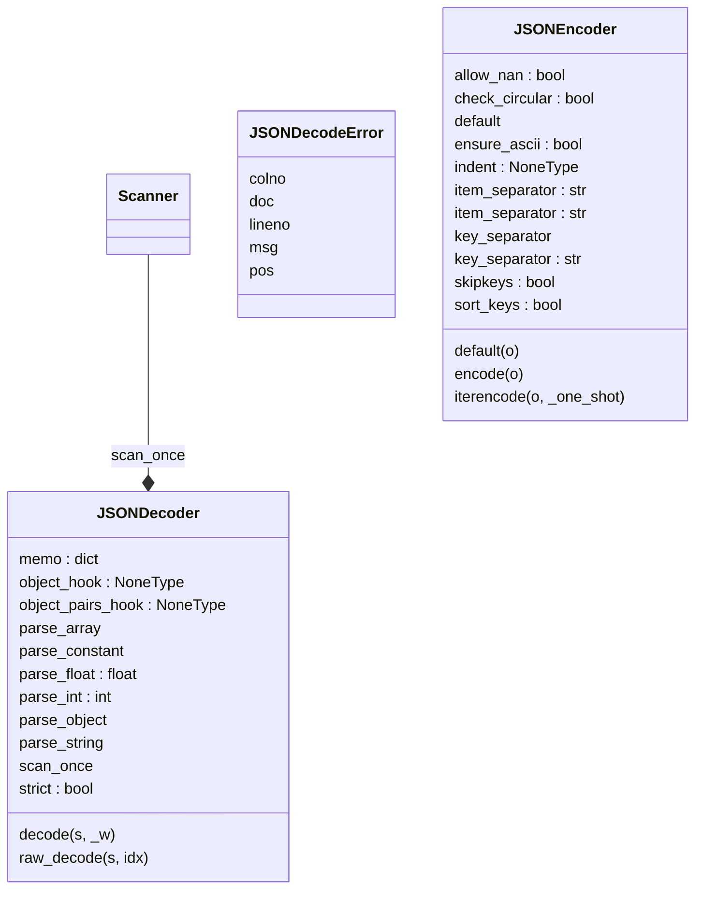

JSON (JavaScript Object Notation) <https://json.org> is a subset of
JavaScript syntax (ECMA-262 3rd edition) used as a lightweight data
interchange format.

:mod:`json` exposes an API familiar to users of the standard library
:mod:`marshal` and :mod:`pickle` modules.  It is derived from a
version of the externally maintained simplejson library.

Encoding basic Python object hierarchies::

    >>> import json
    >>> json.dumps(['foo', {'bar': ('baz', None, 1.0, 2)}])
    '["foo", {"bar": ["baz", null, 1.0, 2]}]'
    >>> print(json.dumps("\"foo\bar"))
    "\"foo\bar"
    >>> print(json.dumps('\u1234'))
    "\u1234"
    >>> print(json.dumps('\\'))
    "\\"
    >>> print(json.dumps({"c": 0, "b": 0, "a": 0}, sort_keys=True))
    {"a": 0, "b": 0, "c": 0}
    >>> from io import StringIO
    >>> io = StringIO()
    >>> json.dump(['streaming API'], io)
    >>> io.getvalue()
    '["streaming API"]'

Compact encoding::

    >>> import json
    >>> mydict = {'4': 5, '6': 7}
    >>> json.dumps([1,2,3,mydict], separators=(',', ':'))
    '[1,2,3,{"4":5,"6":7}]'

Pretty printing::

    >>> import json
    >>> print(json.dumps({'4': 5, '6': 7}, sort_keys=True, indent=4))
    {
        "4": 5,
        "6": 7
    }

Decoding JSON::

    >>> import json
    >>> obj = ['foo', {'bar': ['baz', None, 1.0, 2]}]
    >>> json.loads('["foo", {"bar":["baz", null, 1.0, 2]}]') == obj
    True
    >>> json.loads('"\\"foo\\bar"') == '"foo\x08ar'
    True
    >>> from io import StringIO
    >>> io = StringIO('["streaming API"]')
    >>> json.load(io)[0] == 'streaming API'
    True

Specializing JSON object decoding::

    >>> import json
    >>> def as_complex(dct):
    ...     if '__complex__' in dct:
    ...         return complex(dct['real'], dct['imag'])
    ...     return dct
    ...
    >>> json.loads('{"__complex__": true, "real": 1, "imag": 2}',
    ...     object_hook=as_complex)
    (1+2j)
    >>> from decimal import Decimal
    >>> json.loads('1.1', parse_float=Decimal) == Decimal('1.1')
    True

Specializing JSON object encoding::

    >>> import json
    >>> def encode_complex(obj):
    ...     if isinstance(obj, complex):
    ...         return [obj.real, obj.imag]
    ...     raise TypeError(f'Object of type {obj.__class__.__name__} '
    ...                     f'is not JSON serializable')
    ...
    >>> json.dumps(2 + 1j, default=encode_complex)
    '[2.0, 1.0]'
    >>> json.JSONEncoder(default=encode_complex).encode(2 + 1j)
    '[2.0, 1.0]'
    >>> ''.join(json.JSONEncoder(default=encode_complex).iterencode(2 + 1j))
    '[2.0, 1.0]'


Using json.tool from the shell to validate and pretty-print::

    $ echo '{"json":"obj"}' | python -m json.tool
    {
        "json": "obj"
    }
    $ echo '{ 1.2:3.4}' | python -m json.tool
    Expecting property name enclosed in double quotes: line 1 column 3 (char 2)
## Dev notes
### UML Diagram:



### Objects:

[JSONDecodeError()](#jsondecodeerror)<br />
[JSONDecodeError.__init__()](#jsondecodeerrorinit)<br />
[JSONDecodeError.__reduce__()](#jsondecodeerrorreduce)<br />
[_decode_uXXXX()](#_decode_uxxxx)<br />
[py_scanstring()](#py_scanstring)<br />
[JSONObject()](#jsonobject)<br />
[JSONArray()](#jsonarray)<br />
[JSONDecoder()](#jsondecoder)<br />
[JSONDecoder.__init__()](#jsondecoderinit)<br />
[JSONDecoder.decode()](#jsondecoderdecode)<br />
[JSONDecoder.raw_decode()](#jsondecoderraw_decode)<br />
[py_encode_basestring()](#py_encode_basestring)<br />
[py_encode_basestring.replace()](#py_encode_basestringreplace)<br />
[py_encode_basestring_ascii()](#py_encode_basestring_ascii)<br />
[py_encode_basestring_ascii.replace()](#py_encode_basestring_asciireplace)<br />
[JSONEncoder()](#jsonencoder)<br />
[JSONEncoder.__init__()](#jsonencoderinit)<br />
[JSONEncoder.default()](#jsonencoderdefault)<br />
[JSONEncoder.encode()](#jsonencoderencode)<br />
[JSONEncoder.iterencode()](#jsonencoderiterencode)<br />
[JSONEncoder.iterencode.floatstr()](#jsonencoderiterencodefloatstr)<br />
[_make_iterencode()](#_make_iterencode)<br />
[_make_iterencode._iterencode_list()](#_make_iterencode_iterencode_list)<br />
[_make_iterencode._iterencode_dict()](#_make_iterencode_iterencode_dict)<br />
[_make_iterencode._iterencode()](#_make_iterencode_iterencode)<br />
[py_make_scanner()](#py_make_scanner)<br />
[py_make_scanner._scan_once()](#py_make_scanner_scan_once)<br />
[py_make_scanner.scan_once()](#py_make_scannerscan_once)<br />
[main()](#main)<br />
#### JSONDecodeError()
```python
class JSONDecodeError(ValueError):
```

```
Subclass of ValueError with the following additional properties:

msg: The unformatted error message
doc: The JSON document being parsed
pos: The start index of doc where parsing failed
lineno: The line corresponding to pos
colno: The column corresponding to pos
```

##### JSONDecodeError.__init__()
```python
def JSONDecodeError.__init__(self, msg, doc, pos):
```
> <br />
> None<br />
> <br />
##### JSONDecodeError.__reduce__()
```python
def JSONDecodeError.__reduce__(self):
```
> <br />
> None<br />
> <br />
#### _decode_uXXXX()
```python
def _decode_uXXXX(s, pos):
```
> <br />
> None<br />
> <br />
#### py_scanstring()
```python
def py_scanstring(s, end, strict = True, _b = BACKSLASH, _m = STRINGCHUNK.match):
```
> <br />
> Scan the string s for a JSON string. End is the index of the<br />
> character in s after the quote that started the JSON string.<br />
> Unescapes all valid JSON string escape sequences and raises ValueError<br />
> on attempt to decode an invalid string. If strict is False then literal<br />
> control characters are allowed in the string.<br />
> <br />
> Returns a tuple of the decoded string and the index of the character in s<br />
> after the end quote.<br />
> <br />
#### JSONObject()
```python
def JSONObject(s_and_end, strict, scan_once, object_hook, object_pairs_hook, memo = None, _w = WHITESPACE.match, _ws = WHITESPACE_STR):
```
> <br />
> None<br />
> <br />
#### JSONArray()
```python
def JSONArray(s_and_end, scan_once, _w = WHITESPACE.match, _ws = WHITESPACE_STR):
```
> <br />
> None<br />
> <br />
#### JSONDecoder()
```python
class JSONDecoder(object):
```

```
Simple JSON <https://json.org> decoder

Performs the following translations in decoding by default:

+---------------+-------------------+
| JSON          | Python            |
+===============+===================+
| object        | dict              |
+---------------+-------------------+
| array         | list              |
+---------------+-------------------+
| string        | str               |
+---------------+-------------------+
| number (int)  | int               |
+---------------+-------------------+
| number (real) | float             |
+---------------+-------------------+
| true          | True              |
+---------------+-------------------+
| false         | False             |
+---------------+-------------------+
| null          | None              |
+---------------+-------------------+

It also understands ``NaN``, ``Infinity``, and ``-Infinity`` as
their corresponding ``float`` values, which is outside the JSON spec.
```

##### JSONDecoder.__init__()
```python
def JSONDecoder.__init__(self):
```
> <br />
> ``object_hook``, if specified, will be called with the result<br />
> of every JSON object decoded and its return value will be used in<br />
> place of the given ``dict``.  This can be used to provide custom<br />
> deserializations (e.g. to support JSON-RPC class hinting).<br />
> <br />
> ``object_pairs_hook``, if specified will be called with the result of<br />
> every JSON object decoded with an ordered list of pairs.  The return<br />
> value of ``object_pairs_hook`` will be used instead of the ``dict``.<br />
> This feature can be used to implement custom decoders.<br />
> If ``object_hook`` is also defined, the ``object_pairs_hook`` takes<br />
> priority.<br />
> <br />
> ``parse_float``, if specified, will be called with the string<br />
> of every JSON float to be decoded. By default this is equivalent to<br />
> float(num_str). This can be used to use another datatype or parser<br />
> for JSON floats (e.g. decimal.Decimal).<br />
> <br />
> ``parse_int``, if specified, will be called with the string<br />
> of every JSON int to be decoded. By default this is equivalent to<br />
> int(num_str). This can be used to use another datatype or parser<br />
> for JSON integers (e.g. float).<br />
> <br />
> ``parse_constant``, if specified, will be called with one of the<br />
> following strings: -Infinity, Infinity, NaN.<br />
> This can be used to raise an exception if invalid JSON numbers<br />
> are encountered.<br />
> <br />
> If ``strict`` is false (true is the default), then control<br />
> characters will be allowed inside strings.  Control characters in<br />
> this context are those with character codes in the 0-31 range,<br />
> including ``'\t'`` (tab), ``'\n'``, ``'\r'`` and ``'\0'``.<br />
> <br />
##### JSONDecoder.decode()
```python
def JSONDecoder.decode(self, s, _w = WHITESPACE.match):
```
> <br />
> Return the Python representation of ``s`` (a ``str`` instance<br />
> containing a JSON document).<br />
> <br />
##### JSONDecoder.raw_decode()
```python
def JSONDecoder.raw_decode(self, s, idx = 0):
```
> <br />
> Decode a JSON document from ``s`` (a ``str`` beginning with<br />
> a JSON document) and return a 2-tuple of the Python<br />
> representation and the index in ``s`` where the document ended.<br />
> <br />
> This can be used to decode a JSON document from a string that may<br />
> have extraneous data at the end.<br />
> <br />
#### py_encode_basestring()
```python
def py_encode_basestring(s):
```
> <br />
> Return a JSON representation of a Python string<br />
> <br />
> &nbsp;&nbsp;&nbsp;&nbsp;&nbsp;&nbsp;&nbsp;&nbsp;&nbsp;&nbsp;&nbsp;&nbsp;&nbsp;&nbsp;&nbsp;  <br />
> <br />
##### py_encode_basestring.replace()
```python
def py_encode_basestring.replace(match):
```
> <br />
> None<br />
> <br />
#### py_encode_basestring_ascii()
```python
def py_encode_basestring_ascii(s):
```
> <br />
> Return an ASCII-only JSON representation of a Python string<br />
> <br />
> &nbsp;&nbsp;&nbsp;&nbsp;&nbsp;&nbsp;&nbsp;&nbsp;&nbsp;&nbsp;&nbsp;&nbsp;&nbsp;&nbsp;&nbsp;  <br />
> <br />
##### py_encode_basestring_ascii.replace()
```python
def py_encode_basestring_ascii.replace(match):
```
> <br />
> None<br />
> <br />
#### JSONEncoder()
```python
class JSONEncoder(object):
```

```
Extensible JSON <https://json.org> encoder for Python data structures.

Supports the following objects and types by default:

+-------------------+---------------+
| Python            | JSON          |
+===================+===============+
| dict              | object        |
+-------------------+---------------+
| list, tuple       | array         |
+-------------------+---------------+
| str               | string        |
+-------------------+---------------+
| int, float        | number        |
+-------------------+---------------+
| True              | true          |
+-------------------+---------------+
| False             | false         |
+-------------------+---------------+
| None              | null          |
+-------------------+---------------+

To extend this to recognize other objects, subclass and implement a
``.default()`` method with another method that returns a serializable
object for ``o`` if possible, otherwise it should call the superclass
implementation (to raise ``TypeError``).
```

##### JSONEncoder.__init__()
```python
def JSONEncoder.__init__(self):
```
> <br />
> Constructor for JSONEncoder, with sensible defaults.<br />
> <br />
> If skipkeys is false, then it is a TypeError to attempt<br />
> encoding of keys that are not str, int, float or None.  If<br />
> skipkeys is True, such items are simply skipped.<br />
> <br />
> If ensure_ascii is true, the output is guaranteed to be str<br />
> objects with all incoming non-ASCII characters escaped.  If<br />
> ensure_ascii is false, the output can contain non-ASCII characters.<br />
> <br />
> If check_circular is true, then lists, dicts, and custom encoded<br />
> objects will be checked for circular references during encoding to<br />
> prevent an infinite recursion (which would cause an RecursionError).<br />
> Otherwise, no such check takes place.<br />
> <br />
> If allow_nan is true, then NaN, Infinity, and -Infinity will be<br />
> encoded as such.  This behavior is not JSON specification compliant,<br />
> but is consistent with most JavaScript based encoders and decoders.<br />
> Otherwise, it will be a ValueError to encode such floats.<br />
> <br />
> If sort_keys is true, then the output of dictionaries will be<br />
> sorted by key; this is useful for regression tests to ensure<br />
> that JSON serializations can be compared on a day-to-day basis.<br />
> <br />
> If indent is a non-negative integer, then JSON array<br />
> elements and object members will be pretty-printed with that<br />
> indent level.  An indent level of 0 will only insert newlines.<br />
> None is the most compact representation.<br />
> <br />
> If specified, separators should be an (item_separator, key_separator)<br />
> tuple.  The default is (', ', ': ') if *indent* is ``None`` and<br />
> (',', ': ') otherwise.  To get the most compact JSON representation,<br />
> you should specify (',', ':') to eliminate whitespace.<br />
> <br />
> If specified, default is a function that gets called for objects<br />
> that can't otherwise be serialized.  It should return a JSON encodable<br />
> version of the object or raise a ``TypeError``.<br />
> <br />
##### JSONEncoder.default()
```python
def JSONEncoder.default(self, o):
```
> <br />
> Implement this method in a subclass such that it returns<br />
> a serializable object for ``o``, or calls the base implementation<br />
> (to raise a ``TypeError``).<br />
> <br />
> For example, to support arbitrary iterators, you could<br />
> <b>implement default like this::</b><br />
> <br />
> <b>&nbsp;&nbsp;&nbsp;&nbsp;&nbsp;&nbsp;&nbsp;&nbsp;&nbsp;&nbsp;&nbsp;&nbsp;&nbsp;&nbsp;&nbsp;  def default(self, o):</b><br />
> <b>&nbsp;&nbsp;&nbsp;&nbsp;&nbsp;&nbsp;&nbsp;&nbsp;&nbsp;&nbsp;&nbsp;&nbsp;&nbsp;&nbsp;&nbsp;  &nbsp;&nbsp;&nbsp;&nbsp;&nbsp;&nbsp;&nbsp;&nbsp;&nbsp;&nbsp;&nbsp;&nbsp;&nbsp;&nbsp;&nbsp;  try:</b><br />
> &nbsp;&nbsp;&nbsp;&nbsp;&nbsp;&nbsp;&nbsp;&nbsp;&nbsp;&nbsp;&nbsp;&nbsp;&nbsp;&nbsp;&nbsp;  &nbsp;&nbsp;&nbsp;&nbsp;&nbsp;&nbsp;&nbsp;&nbsp;&nbsp;&nbsp;&nbsp;&nbsp;&nbsp;&nbsp;&nbsp;  &nbsp;&nbsp;&nbsp;&nbsp;&nbsp;&nbsp;&nbsp;&nbsp;&nbsp;&nbsp;&nbsp;&nbsp;&nbsp;&nbsp;&nbsp;  iterable = iter(o)<br />
> <b>&nbsp;&nbsp;&nbsp;&nbsp;&nbsp;&nbsp;&nbsp;&nbsp;&nbsp;&nbsp;&nbsp;&nbsp;&nbsp;&nbsp;&nbsp;  &nbsp;&nbsp;&nbsp;&nbsp;&nbsp;&nbsp;&nbsp;&nbsp;&nbsp;&nbsp;&nbsp;&nbsp;&nbsp;&nbsp;&nbsp;  except TypeError:</b><br />
> &nbsp;&nbsp;&nbsp;&nbsp;&nbsp;&nbsp;&nbsp;&nbsp;&nbsp;&nbsp;&nbsp;&nbsp;&nbsp;&nbsp;&nbsp;  &nbsp;&nbsp;&nbsp;&nbsp;&nbsp;&nbsp;&nbsp;&nbsp;&nbsp;&nbsp;&nbsp;&nbsp;&nbsp;&nbsp;&nbsp;  &nbsp;&nbsp;&nbsp;&nbsp;&nbsp;&nbsp;&nbsp;&nbsp;&nbsp;&nbsp;&nbsp;&nbsp;&nbsp;&nbsp;&nbsp;  pass<br />
> <b>&nbsp;&nbsp;&nbsp;&nbsp;&nbsp;&nbsp;&nbsp;&nbsp;&nbsp;&nbsp;&nbsp;&nbsp;&nbsp;&nbsp;&nbsp;  &nbsp;&nbsp;&nbsp;&nbsp;&nbsp;&nbsp;&nbsp;&nbsp;&nbsp;&nbsp;&nbsp;&nbsp;&nbsp;&nbsp;&nbsp;  else:</b><br />
> &nbsp;&nbsp;&nbsp;&nbsp;&nbsp;&nbsp;&nbsp;&nbsp;&nbsp;&nbsp;&nbsp;&nbsp;&nbsp;&nbsp;&nbsp;  &nbsp;&nbsp;&nbsp;&nbsp;&nbsp;&nbsp;&nbsp;&nbsp;&nbsp;&nbsp;&nbsp;&nbsp;&nbsp;&nbsp;&nbsp;  &nbsp;&nbsp;&nbsp;&nbsp;&nbsp;&nbsp;&nbsp;&nbsp;&nbsp;&nbsp;&nbsp;&nbsp;&nbsp;&nbsp;&nbsp;  return list(iterable)<br />
> &nbsp;&nbsp;&nbsp;&nbsp;&nbsp;&nbsp;&nbsp;&nbsp;&nbsp;&nbsp;&nbsp;&nbsp;&nbsp;&nbsp;&nbsp;  &nbsp;&nbsp;&nbsp;&nbsp;&nbsp;&nbsp;&nbsp;&nbsp;&nbsp;&nbsp;&nbsp;&nbsp;&nbsp;&nbsp;&nbsp;  # Let the base class default method raise the TypeError<br />
> &nbsp;&nbsp;&nbsp;&nbsp;&nbsp;&nbsp;&nbsp;&nbsp;&nbsp;&nbsp;&nbsp;&nbsp;&nbsp;&nbsp;&nbsp;  &nbsp;&nbsp;&nbsp;&nbsp;&nbsp;&nbsp;&nbsp;&nbsp;&nbsp;&nbsp;&nbsp;&nbsp;&nbsp;&nbsp;&nbsp;  return JSONEncoder.default(self, o)<br />
> <br />
##### JSONEncoder.encode()
```python
def JSONEncoder.encode(self, o):
```
> <br />
> Return a JSON string representation of a Python data structure.<br />
> <br />
> >>> from json.encoder import JSONEncoder<br />
> >>> JSONEncoder().encode({"foo": ["bar", "baz"]})<br />
> '{"foo": ["bar", "baz"]}'<br />
> <br />
##### JSONEncoder.iterencode()
```python
def JSONEncoder.iterencode(self, o, _one_shot = False):
```
> <br />
> Encode the given object and yield each string<br />
> representation as available.<br />
> <br />
> <b>For example::</b><br />
> <br />
> <b>&nbsp;&nbsp;&nbsp;&nbsp;&nbsp;&nbsp;&nbsp;&nbsp;&nbsp;&nbsp;&nbsp;&nbsp;&nbsp;&nbsp;&nbsp;  for chunk in JSONEncoder().iterencode(bigobject):</b><br />
> &nbsp;&nbsp;&nbsp;&nbsp;&nbsp;&nbsp;&nbsp;&nbsp;&nbsp;&nbsp;&nbsp;&nbsp;&nbsp;&nbsp;&nbsp;  &nbsp;&nbsp;&nbsp;&nbsp;&nbsp;&nbsp;&nbsp;&nbsp;&nbsp;&nbsp;&nbsp;&nbsp;&nbsp;&nbsp;&nbsp;  mysocket.write(chunk)<br />
> <br />
###### JSONEncoder.iterencode.floatstr()
```python
def JSONEncoder.iterencode.floatstr(o, allow_nan = self.allow_nan, _repr = float.__repr__, _inf = INFINITY, _neginf = -INFINITY):
```
> <br />
> None<br />
> <br />
#### _make_iterencode()
```python
def _make_iterencode(markers, _default, _encoder, _indent, _floatstr, _key_separator, _item_separator, _sort_keys, _skipkeys, _one_shot, ValueError = ValueError, dict = dict, float = float, id = id, int = int, isinstance = isinstance, list = list, str = str, tuple = tuple, _intstr = int.__repr__):
```
> <br />
> None<br />
> <br />
##### _make_iterencode._iterencode_list()
```python
def _make_iterencode._iterencode_list(lst, _current_indent_level):
```
> <br />
> None<br />
> <br />
##### _make_iterencode._iterencode_dict()
```python
def _make_iterencode._iterencode_dict(dct, _current_indent_level):
```
> <br />
> None<br />
> <br />
##### _make_iterencode._iterencode()
```python
def _make_iterencode._iterencode(o, _current_indent_level):
```
> <br />
> None<br />
> <br />
#### py_make_scanner()
```python
def py_make_scanner(context):
```
> <br />
> None<br />
> <br />
##### py_make_scanner._scan_once()
```python
def py_make_scanner._scan_once(string, idx):
```
> <br />
> None<br />
> <br />
##### py_make_scanner.scan_once()
```python
def py_make_scanner.scan_once(string, idx):
```
> <br />
> None<br />
> <br />
#### main()
```python
def main():
```
> <br />
> None<br />
> <br />