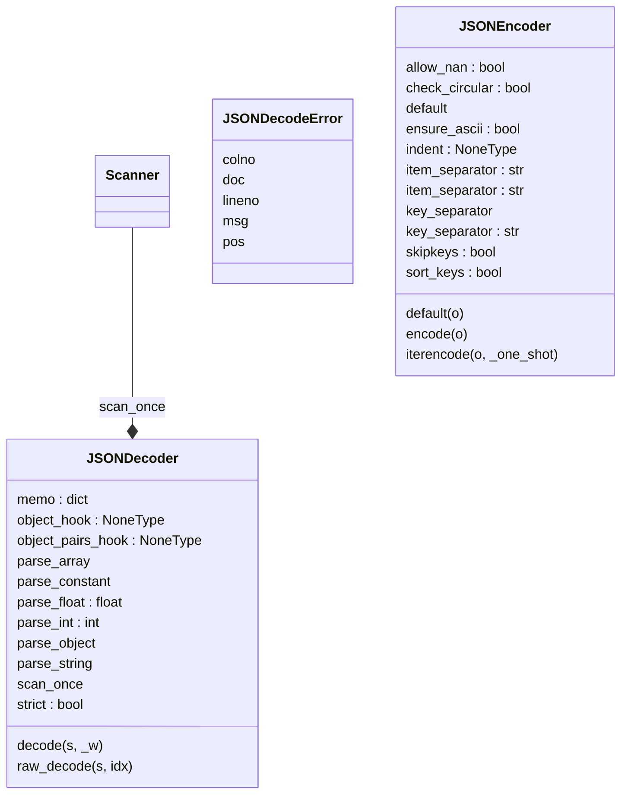

JSON (JavaScript Object Notation) <https://json.org> is a subset of
JavaScript syntax (ECMA-262 3rd edition) used as a lightweight data
interchange format.

:mod:`json` exposes an API familiar to users of the standard library
:mod:`marshal` and :mod:`pickle` modules.  It is derived from a
version of the externally maintained simplejson library.

    # Encoding basic Python object hierarchies::

    >>> import json
    >>> json.dumps(['foo', {'bar': ('baz', None, 1.0, 2)}])
    '["foo", {"bar": ["baz", null, 1.0, 2]}]'
    >>> print(json.dumps("\"foo\bar"))
    "\"foo\bar"
    >>> print(json.dumps('\u1234'))
    "\u1234"
    >>> print(json.dumps('\\'))
    "\\"
    >>> print(json.dumps({"c": 0, "b": 0, "a": 0}, sort_keys=True))
    {"a": 0, "b": 0, "c": 0}
    >>> from io import StringIO
    >>> io = StringIO()
    >>> json.dump(['streaming API'], io)
    >>> io.getvalue()
    '["streaming API"]'

    # Compact encoding::

    >>> import json
    >>> mydict = {'4': 5, '6': 7}
    >>> json.dumps([1,2,3,mydict], separators=(',', ':'))
    '[1,2,3,{"4":5,"6":7}]'

    # Pretty printing::

    >>> import json
    >>> print(json.dumps({'4': 5, '6': 7}, sort_keys=True, indent=4))
    {
        "4": 5,
        "6": 7
    }

    # Decoding JSON::

    >>> import json
    >>> obj = ['foo', {'bar': ['baz', None, 1.0, 2]}]
    >>> json.loads('["foo", {"bar":["baz", null, 1.0, 2]}]') == obj
    True
    >>> json.loads('"\\"foo\\bar"') == '"foo\x08ar'
    True
    >>> from io import StringIO
    >>> io = StringIO('["streaming API"]')
    >>> json.load(io)[0] == 'streaming API'
    True

    # Specializing JSON object decoding::

    >>> import json
    >>> def as_complex(dct):
    ...     if '__complex__' in dct:
    ...         return complex(dct['real'], dct['imag'])
    ...     return dct
    ...
    >>> json.loads('{"__complex__": true, "real": 1, "imag": 2}',
    ...     object_hook=as_complex)
    (1+2j)
    >>> from decimal import Decimal
    >>> json.loads('1.1', parse_float=Decimal) == Decimal('1.1')
    True

    # Specializing JSON object encoding::

    >>> import json
    >>> def encode_complex(obj):
    ...     if isinstance(obj, complex):
    ...         return [obj.real, obj.imag]
    ...     raise TypeError(f'Object of type {obj.__class__.__name__} '
    ...                     f'is not JSON serializable')
    ...
    >>> json.dumps(2 + 1j, default=encode_complex)
    '[2.0, 1.0]'
    >>> json.JSONEncoder(default=encode_complex).encode(2 + 1j)
    '[2.0, 1.0]'
    >>> ''.join(json.JSONEncoder(default=encode_complex).iterencode(2 + 1j))
    '[2.0, 1.0]'


    # Using json.tool from the shell to validate and pretty-print::

    $ echo '{"json":"obj"}' | python -m json.tool
    {
        "json": "obj"
    }
    $ echo '{ 1.2:3.4}' | python -m json.tool
    Expecting property name enclosed in double quotes: line 1 column 3 (char 2)
# Dev notes
## UML Diagram:


## Objects:

[dump()](#dump)<br />
[dumps()](#dumps)<br />
[detect_encoding()](#detect_encoding)<br />
[load()](#load)<br />
[loads()](#loads)<br />
[JSONDecodeError()](#jsondecodeerror)<br />
[JSONDecodeError.__init__()](#jsondecodeerrorinit)<br />
[JSONDecodeError.__reduce__()](#jsondecodeerrorreduce)<br />
[_decode_uXXXX()](#_decode_uxxxx)<br />
[py_scanstring()](#py_scanstring)<br />
[JSONObject()](#jsonobject)<br />
[JSONArray()](#jsonarray)<br />
[JSONDecoder()](#jsondecoder)<br />
[JSONDecoder.__init__()](#jsondecoderinit)<br />
[JSONDecoder.decode()](#jsondecoderdecode)<br />
[JSONDecoder.raw_decode()](#jsondecoderraw_decode)<br />
[py_encode_basestring()](#py_encode_basestring)<br />
[py_encode_basestring.replace()](#py_encode_basestringreplace)<br />
[py_encode_basestring_ascii()](#py_encode_basestring_ascii)<br />
[py_encode_basestring_ascii.replace()](#py_encode_basestring_asciireplace)<br />
[JSONEncoder()](#jsonencoder)<br />
[JSONEncoder.__init__()](#jsonencoderinit)<br />
[JSONEncoder.default()](#jsonencoderdefault)<br />
[JSONEncoder.encode()](#jsonencoderencode)<br />
[JSONEncoder.iterencode()](#jsonencoderiterencode)<br />
[JSONEncoder.iterencode.floatstr()](#jsonencoderiterencodefloatstr)<br />
[_make_iterencode()](#_make_iterencode)<br />
[_make_iterencode._iterencode_list()](#_make_iterencode_iterencode_list)<br />
[_make_iterencode._iterencode_dict()](#_make_iterencode_iterencode_dict)<br />
[_make_iterencode._iterencode()](#_make_iterencode_iterencode)<br />
[py_make_scanner()](#py_make_scanner)<br />
[py_make_scanner._scan_once()](#py_make_scanner_scan_once)<br />
[py_make_scanner.scan_once()](#py_make_scannerscan_once)<br />
[main()](#main)<br />
### dump()
```python
def dump(obj, fp, **kw):
```
<pre>

Serialize ``obj`` as a JSON formatted stream to ``fp`` (a
``.write()``-supporting file-like object).

If ``skipkeys`` is true then ``dict`` keys that are not basic types
(``str``, ``int``, ``float``, ``bool``, ``None``) will be skipped
instead of raising a ``TypeError``.

If ``ensure_ascii`` is false, then the strings written to ``fp`` can
contain non-ASCII characters if they appear in strings contained in
``obj``. Otherwise, all such characters are escaped in JSON strings.

If ``check_circular`` is false, then the circular reference check
for container types will be skipped and a circular reference will
result in an ``RecursionError`` (or worse).

If ``allow_nan`` is false, then it will be a ``ValueError`` to
serialize out of range ``float`` values (``nan``, ``inf``, ``-inf``)
in strict compliance of the JSON specification, instead of using the
JavaScript equivalents (``NaN``, ``Infinity``, ``-Infinity``).

If ``indent`` is a non-negative integer, then JSON array elements and
object members will be pretty-printed with that indent level. An indent
level of 0 will only insert newlines. ``None`` is the most compact
representation.

If specified, ``separators`` should be an ``(item_separator, key_separator)``
tuple.  The default is ``(', ', ': ')`` if *indent* is ``None`` and
``(',', ': ')`` otherwise.  To get the most compact JSON representation,
you should specify ``(',', ':')`` to eliminate whitespace.

``default(obj)`` is a function that should return a serializable version
of obj or raise TypeError. The default simply raises TypeError.

If *sort_keys* is true (default: ``False``), then the output of
dictionaries will be sorted by key.

To use a custom ``JSONEncoder`` subclass (e.g. one that overrides the
``.default()`` method to serialize additional types), specify it with
the ``cls`` kwarg; otherwise ``JSONEncoder`` is used.

</pre>
### dumps()
```python
def dumps(obj, **kw):
```
<pre>

Serialize ``obj`` to a JSON formatted ``str``.

If ``skipkeys`` is true then ``dict`` keys that are not basic types
(``str``, ``int``, ``float``, ``bool``, ``None``) will be skipped
instead of raising a ``TypeError``.

If ``ensure_ascii`` is false, then the return value can contain non-ASCII
characters if they appear in strings contained in ``obj``. Otherwise, all
such characters are escaped in JSON strings.

If ``check_circular`` is false, then the circular reference check
for container types will be skipped and a circular reference will
result in an ``RecursionError`` (or worse).

If ``allow_nan`` is false, then it will be a ``ValueError`` to
serialize out of range ``float`` values (``nan``, ``inf``, ``-inf``) in
strict compliance of the JSON specification, instead of using the
JavaScript equivalents (``NaN``, ``Infinity``, ``-Infinity``).

If ``indent`` is a non-negative integer, then JSON array elements and
object members will be pretty-printed with that indent level. An indent
level of 0 will only insert newlines. ``None`` is the most compact
representation.

If specified, ``separators`` should be an ``(item_separator, key_separator)``
tuple.  The default is ``(', ', ': ')`` if *indent* is ``None`` and
``(',', ': ')`` otherwise.  To get the most compact JSON representation,
you should specify ``(',', ':')`` to eliminate whitespace.

``default(obj)`` is a function that should return a serializable version
of obj or raise TypeError. The default simply raises TypeError.

If *sort_keys* is true (default: ``False``), then the output of
dictionaries will be sorted by key.

To use a custom ``JSONEncoder`` subclass (e.g. one that overrides the
``.default()`` method to serialize additional types), specify it with
the ``cls`` kwarg; otherwise ``JSONEncoder`` is used.

</pre>
### detect_encoding()
```python
def detect_encoding(b):
```
<pre>

None

</pre>
### load()
```python
def load(fp, **kw):
```
<pre>

Deserialize ``fp`` (a ``.read()``-supporting file-like object containing
a JSON document) to a Python object.

``object_hook`` is an optional function that will be called with the
result of any object literal decode (a ``dict``). The return value of
``object_hook`` will be used instead of the ``dict``. This feature
can be used to implement custom decoders (e.g. JSON-RPC class hinting).

``object_pairs_hook`` is an optional function that will be called with the
result of any object literal decoded with an ordered list of pairs.  The
return value of ``object_pairs_hook`` will be used instead of the ``dict``.
This feature can be used to implement custom decoders.  If ``object_hook``
is also defined, the ``object_pairs_hook`` takes priority.

To use a custom ``JSONDecoder`` subclass, specify it with the ``cls``
kwarg; otherwise ``JSONDecoder`` is used.

</pre>
### loads()
```python
def loads(s, **kw):
```
<pre>

Deserialize ``s`` (a ``str``, ``bytes`` or ``bytearray`` instance
containing a JSON document) to a Python object.

``object_hook`` is an optional function that will be called with the
result of any object literal decode (a ``dict``). The return value of
``object_hook`` will be used instead of the ``dict``. This feature
can be used to implement custom decoders (e.g. JSON-RPC class hinting).

``object_pairs_hook`` is an optional function that will be called with the
result of any object literal decoded with an ordered list of pairs.  The
return value of ``object_pairs_hook`` will be used instead of the ``dict``.
This feature can be used to implement custom decoders.  If ``object_hook``
is also defined, the ``object_pairs_hook`` takes priority.

``parse_float``, if specified, will be called with the string
of every JSON float to be decoded. By default this is equivalent to
float(num_str). This can be used to use another datatype or parser
for JSON floats (e.g. decimal.Decimal).

``parse_int``, if specified, will be called with the string
of every JSON int to be decoded. By default this is equivalent to
int(num_str). This can be used to use another datatype or parser
for JSON integers (e.g. float).

``parse_constant``, if specified, will be called with one of the
following strings: -Infinity, Infinity, NaN.
This can be used to raise an exception if invalid JSON numbers
are encountered.

To use a custom ``JSONDecoder`` subclass, specify it with the ``cls``
kwarg; otherwise ``JSONDecoder`` is used.

</pre>
### JSONDecodeError()
```python
class JSONDecodeError(ValueError):
```
<pre>

<b>Subclass of ValueError with the following additional properties:</b>

msg: The unformatted error message
doc: The JSON document being parsed
pos: The start index of doc where parsing failed
lineno: The line corresponding to pos
colno: The column corresponding to pos

</pre>
#### JSONDecodeError.__init__()
```python
def JSONDecodeError.__init__(self, msg, doc, pos):
```
<pre>

None

</pre>
#### JSONDecodeError.__reduce__()
```python
def JSONDecodeError.__reduce__(self):
```
<pre>

None

</pre>
### _decode_uXXXX()
```python
def _decode_uXXXX(s, pos):
```
<pre>

None

</pre>
### py_scanstring()
```python
def py_scanstring(s, end, strict = True, _b = BACKSLASH, _m = STRINGCHUNK.match):
```
<pre>

Scan the string s for a JSON string. End is the index of the
character in s after the quote that started the JSON string.
Unescapes all valid JSON string escape sequences and raises ValueError
on attempt to decode an invalid string. If strict is False then literal
control characters are allowed in the string.

Returns a tuple of the decoded string and the index of the character in s
after the end quote.

</pre>
### JSONObject()
```python
def JSONObject(s_and_end, strict, scan_once, object_hook, object_pairs_hook, memo = None, _w = WHITESPACE.match, _ws = WHITESPACE_STR):
```
<pre>

None

</pre>
### JSONArray()
```python
def JSONArray(s_and_end, scan_once, _w = WHITESPACE.match, _ws = WHITESPACE_STR):
```
<pre>

None

</pre>
### JSONDecoder()
```python
class JSONDecoder(object):
```
<pre>

Simple JSON <https://json.org> decoder

<b>Performs the following translations in decoding by default:</b>

+---------------+-------------------+
| JSON          | Python            |
+===============+===================+
| object        | dict              |
+---------------+-------------------+
| array         | list              |
+---------------+-------------------+
| string        | str               |
+---------------+-------------------+
| number (int)  | int               |
+---------------+-------------------+
| number (real) | float             |
+---------------+-------------------+
| true          | True              |
+---------------+-------------------+
| false         | False             |
+---------------+-------------------+
| null          | None              |
+---------------+-------------------+

It also understands ``NaN``, ``Infinity``, and ``-Infinity`` as
their corresponding ``float`` values, which is outside the JSON spec.

</pre>
#### JSONDecoder.__init__()
```python
def JSONDecoder.__init__(self):
```
<pre>

``object_hook``, if specified, will be called with the result
of every JSON object decoded and its return value will be used in
place of the given ``dict``.  This can be used to provide custom
deserializations (e.g. to support JSON-RPC class hinting).

``object_pairs_hook``, if specified will be called with the result of
every JSON object decoded with an ordered list of pairs.  The return
value of ``object_pairs_hook`` will be used instead of the ``dict``.
This feature can be used to implement custom decoders.
If ``object_hook`` is also defined, the ``object_pairs_hook`` takes
priority.

``parse_float``, if specified, will be called with the string
of every JSON float to be decoded. By default this is equivalent to
float(num_str). This can be used to use another datatype or parser
for JSON floats (e.g. decimal.Decimal).

``parse_int``, if specified, will be called with the string
of every JSON int to be decoded. By default this is equivalent to
int(num_str). This can be used to use another datatype or parser
for JSON integers (e.g. float).

``parse_constant``, if specified, will be called with one of the
following strings: -Infinity, Infinity, NaN.
This can be used to raise an exception if invalid JSON numbers
are encountered.

If ``strict`` is false (true is the default), then control
characters will be allowed inside strings.  Control characters in
this context are those with character codes in the 0-31 range,
including ``'\t'`` (tab), ``'\n'``, ``'\r'`` and ``'\0'``.

</pre>
#### JSONDecoder.decode()
```python
def JSONDecoder.decode(self, s, _w = WHITESPACE.match):
```
<pre>

Return the Python representation of ``s`` (a ``str`` instance
containing a JSON document).

</pre>
#### JSONDecoder.raw_decode()
```python
def JSONDecoder.raw_decode(self, s, idx = 0):
```
<pre>

Decode a JSON document from ``s`` (a ``str`` beginning with
a JSON document) and return a 2-tuple of the Python
representation and the index in ``s`` where the document ended.

This can be used to decode a JSON document from a string that may
have extraneous data at the end.

</pre>
### py_encode_basestring()
```python
def py_encode_basestring(s):
```
<pre>

Return a JSON representation of a Python string

    

</pre>
#### py_encode_basestring.replace()
```python
def py_encode_basestring.replace(match):
```
<pre>

None

</pre>
### py_encode_basestring_ascii()
```python
def py_encode_basestring_ascii(s):
```
<pre>

Return an ASCII-only JSON representation of a Python string

    

</pre>
#### py_encode_basestring_ascii.replace()
```python
def py_encode_basestring_ascii.replace(match):
```
<pre>

None

</pre>
### JSONEncoder()
```python
class JSONEncoder(object):
```
<pre>

Extensible JSON <https://json.org> encoder for Python data structures.

<b>Supports the following objects and types by default:</b>

+-------------------+---------------+
| Python            | JSON          |
+===================+===============+
| dict              | object        |
+-------------------+---------------+
| list, tuple       | array         |
+-------------------+---------------+
| str               | string        |
+-------------------+---------------+
| int, float        | number        |
+-------------------+---------------+
| True              | true          |
+-------------------+---------------+
| False             | false         |
+-------------------+---------------+
| None              | null          |
+-------------------+---------------+

To extend this to recognize other objects, subclass and implement a
``.default()`` method with another method that returns a serializable
object for ``o`` if possible, otherwise it should call the superclass
implementation (to raise ``TypeError``).

</pre>
#### JSONEncoder.__init__()
```python
def JSONEncoder.__init__(self):
```
<pre>

Constructor for JSONEncoder, with sensible defaults.

If skipkeys is false, then it is a TypeError to attempt
encoding of keys that are not str, int, float or None.  If
skipkeys is True, such items are simply skipped.

If ensure_ascii is true, the output is guaranteed to be str
objects with all incoming non-ASCII characters escaped.  If
ensure_ascii is false, the output can contain non-ASCII characters.

If check_circular is true, then lists, dicts, and custom encoded
objects will be checked for circular references during encoding to
prevent an infinite recursion (which would cause an RecursionError).
Otherwise, no such check takes place.

If allow_nan is true, then NaN, Infinity, and -Infinity will be
encoded as such.  This behavior is not JSON specification compliant,
but is consistent with most JavaScript based encoders and decoders.
Otherwise, it will be a ValueError to encode such floats.

If sort_keys is true, then the output of dictionaries will be
sorted by key; this is useful for regression tests to ensure
that JSON serializations can be compared on a day-to-day basis.

If indent is a non-negative integer, then JSON array
elements and object members will be pretty-printed with that
indent level.  An indent level of 0 will only insert newlines.
None is the most compact representation.

If specified, separators should be an (item_separator, key_separator)
tuple.  The default is (', ', ': ') if *indent* is ``None`` and
(',', ': ') otherwise.  To get the most compact JSON representation,
you should specify (',', ':') to eliminate whitespace.

If specified, default is a function that gets called for objects
that can't otherwise be serialized.  It should return a JSON encodable
version of the object or raise a ``TypeError``.

</pre>
#### JSONEncoder.default()
```python
def JSONEncoder.default(self, o):
```
<pre>

Implement this method in a subclass such that it returns
a serializable object for ``o``, or calls the base implementation
(to raise a ``TypeError``).

For example, to support arbitrary iterators, you could
<b>implement default like this::</b>

    def default(self, o):
        try:
            iterable = iter(o)
        except TypeError:
            pass
        else:
            return list(iterable)
        # Let the base class default method raise the TypeError
        return JSONEncoder.default(self, o)

</pre>
#### JSONEncoder.encode()
```python
def JSONEncoder.encode(self, o):
```
<pre>

Return a JSON string representation of a Python data structure.

>>> from json.encoder import JSONEncoder
>>> JSONEncoder().encode({"foo": ["bar", "baz"]})
'{"foo": ["bar", "baz"]}'

</pre>
#### JSONEncoder.iterencode()
```python
def JSONEncoder.iterencode(self, o, _one_shot = False):
```
<pre>

Encode the given object and yield each string
representation as available.

<b>For example::</b>

    for chunk in JSONEncoder().iterencode(bigobject):
        mysocket.write(chunk)

</pre>
##### JSONEncoder.iterencode.floatstr()
```python
def JSONEncoder.iterencode.floatstr(o, allow_nan = self.allow_nan, _repr = float.__repr__, _inf = INFINITY, _neginf = -INFINITY):
```
<pre>

None

</pre>
### _make_iterencode()
```python
def _make_iterencode(markers, _default, _encoder, _indent, _floatstr, _key_separator, _item_separator, _sort_keys, _skipkeys, _one_shot, ValueError = ValueError, dict = dict, float = float, id = id, int = int, isinstance = isinstance, list = list, str = str, tuple = tuple, _intstr = int.__repr__):
```
<pre>

None

</pre>
#### _make_iterencode._iterencode_list()
```python
def _make_iterencode._iterencode_list(lst, _current_indent_level):
```
<pre>

None

</pre>
#### _make_iterencode._iterencode_dict()
```python
def _make_iterencode._iterencode_dict(dct, _current_indent_level):
```
<pre>

None

</pre>
#### _make_iterencode._iterencode()
```python
def _make_iterencode._iterencode(o, _current_indent_level):
```
<pre>

None

</pre>
### py_make_scanner()
```python
def py_make_scanner(context):
```
<pre>

None

</pre>
#### py_make_scanner._scan_once()
```python
def py_make_scanner._scan_once(string, idx):
```
<pre>

None

</pre>
#### py_make_scanner.scan_once()
```python
def py_make_scanner.scan_once(string, idx):
```
<pre>

None

</pre>
### main()
```python
def main():
```
<pre>

None

</pre>